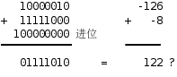
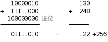

# 3. 整数的加减运算

我们已经了解了计算机中正整数如何表示，加法如何计算，那么负数如何表示，减法又如何计算呢？本节讨论这些问题。为了书写方便，本节举的例子都用8个bit表示一个数，实际计算机做整数加减运算的操作数可以是8位、16位、32位甚至64位的。

## 3.1. Sign and Magnitude表示法

要用8个bit表示正数和负数，一种简单的想法是把最高位规定为符号位（Sign Bit），0表示正1表示负，剩下的7位表示绝对值的大小，这称为Sign and Magnitude表示法。例如-1表示成10000001，+1表示成00000001。这样用8个bit表示整数的取值范围是-27-1~27-1，即-127~127。

采用这种表示法，计算机做加法运算需要处理以下逻辑：

1. 如果两数符号位相同，就把它们的低7位相加，符号位不变。如果低7位相加时在最高位产生进位，说明结果的绝对值大于127，超出7位所能表示的数值范围，这称为溢出（Overflow）[^1]，这时通常把计算机中的一个标志位置1表示当前运算产生了溢出。

2. 如果两数符号位不同，首先比较它们的低7位谁大，然后用大数减小数，结果的符号位和大数相同。

那么减法如何计算呢？由于我们规定了负数的表示，可以把减法转换成加法来计算，要计算a-b，可以先把b变号然后和a相加，相当于计算a+(-b)。但如果两个加数的符号位不同就要用大数的绝对值减小数的绝对值，这一步减法计算仍然是免不了的。我们知道加法要进位，减法要借位，计算过程是不同的，所以除了要有第1节提到的加法器电路之外，还要另外有一套减法器电路。

如果采用Sign and Magnitude表示法，计算机做加减运算需要处理很多逻辑：比较符号位，比较绝对值，加法改减法，减法改加法，小数减大数改成大数减小数……这是非常低效率的。还有一个缺点是0的表示不唯一，既可以表示成10000000也可以表示成00000000，这进一步增加了逻辑的复杂性，所以我们迫切需要重新设计整数的表示方法使计算过程更简单。

## 3.2. 1's Complement表示法

本节介绍一种二进制补码表示法，为了便于理解，我们先看一个十进制的例子：

167-52=167+(-52)=167+(999-52)-1000+1=167+947-1000+1=1114-1000+1=114+1=115  
167-52 → 减法转换成加法 167+(-52) → 负数取9的补码表示 167+947 → 114进1 → 高位进的1加到低位上去，结果为115

在这个例子中我们用三位十进制数字表示正数和负数，具体规定如下：

| 数值 | 补码表示 |
|------|----------|
| -499 | 500 |
| -498 | 501 |
| ... | ... |
| -1 | 998 |
| 0 | 999 |
| 0 | 0 |
| 1 | 1 |
| ... | ... |
| 498 | 498 |
| 499 | 499 |

首先-52要用999-52表示，就是947，这称为取9的补码（9's Complement）；然后把167和947相加，得到114进1；再把高位进的1加到低位上去，得115，本来应该加1000，结果加了1，少加了999，正好把先前取9的补码多加的999抵消掉了。我们本来要做167-52的减法运算，结果变成做999-52的减法运算，后者显然要容易一些，因为没有借位。这种补码表示法的计算规则用一句话概括就是：负数用9的补码表示，减法转换成加法，计算结果的最高位如果有进位则要加回到最低位上去。要验证这条规则得考虑四种情况：

1. 两个正数，相加得正
2. 一正一负，相加得正
3. 一正一负，相加得负
4. 两个负数，相加得负

我们举的例子验证了第二种情况，另外三种情况请读者自己验证，暂时不考虑溢出的问题，稍后会讲到如何判定溢出。

上述规则也适用于二进制：**负数用1的补码（1's Complement）表示，减法转换成加法，计算结果的最高位如果有进位则要加回到最低位上去**。取1的补码更简单，连减法都不用做，因为1-1=0，1-0=1，取1的补码就是把每个bit取反，所以1的补码也称为反码。比如：

00001000-00000100 → 00001000+(-00000100) → 00001000+11111011 → 00000011进1 → 高位进的1加到低位上去，结果为00000100

1's Complement表示法相对于Sign and Magnitude表示法的优势是非常明显的：不需要把符号和绝对值分开考虑，正数和负数的加法都一样算，计算逻辑更简单，甚至连减法器电路都省了，只要有一套加法器电路，再有一套把每个bit取反的电路，就可以做加法和减法运算。如果8个bit采用1's Complement表示法，负数的取值范围是从10000000到11111111（-127~0），正数是从00000000到01111111（0~127），仍然可以根据最高位判断一个数是正是负。美中不足的是0的表示仍然不唯一，既可以表示成11111111也可以表示成00000000，为了解决这最后一个问题，我们引入2's Complement表示法。

## 3.3. 2's Complement表示法

2's Complement表示法规定：正数不变，负数先取反码再加1。如果8个bit采用2's Complement表示法，负数的取值范围是从10000000到11111111（-128~-1），正数是从00000000到01111111（0~127），也可以根据最高位判断一个数是正是负，并且0的表示是唯一的，目前绝大多数计算机都采用这种表示法。为什么称为"2的补码"呢？因为对一位二进制数b取补码就是1-b+1=10-b，相当于从2里面减去b。类似地，要表示-4需要对00000100取补码，11111111-00000100+1=100000000-00000100，相当于从28里面减去4。2's Complement表示法的计算规则有些不同：减法转换成加法，忽略计算结果最高位的进位，不必加回到最低位上去。请读者自己验证上一节提到的四种情况下这条规则都能算出正确结果。

8个bit采用2's Complement表示法的取值范围是-128~127，如果计算结果超出这个范围就会产生溢出，例如：

如何判断产生了溢出呢？我们还是分四种情况讨论：如果两个正数相加溢出，结果一定是负数；如果两个负数相加溢出，结果一定是正数；一正一负相加，无论结果是正是负都不可能溢出。

从上图可以得出结论：**在相加过程中最高位产生的进位和次高位产生的进位如果相同则没有溢出，如果不同则表示有溢出**。逻辑电路的实现可以把这两个进位连接到一个异或门，把异或门的输出连接到溢出标志位。

## 3.4. 有符号数和无符号数

前面几节我们用8个bit表示正数和负数，讲了三种表示法，每种表示法对应一种计算规则，这称为有符号数（Signed Number）；如果8个bit全部表示正数则取值范围是0~255，这称为无符号数（Unsigned Number）。其实计算机做加法时并不区分操作数是有符号数还是无符号数，计算过程都一样，比如上面的例子也可以看作无符号数的加法：

如果把这两个操作数看作有符号数-126和-8相加，计算结果是错的，因为产生了溢出；但如果看作无符号数130和248相加，计算结果是122进1，也就是122+256，这个结果是对的。计算机的加法器在做完计算之后，根据最高位产生的进位设置**进位标志**，同时根据最高位和次高位产生的进位的异或设置**溢出标志**。至于这个加法到底是有符号数加法还是无符号数加法则取决于程序怎么理解了，如果程序把它理解成有符号数加法，下一步就要检查溢出标志，如果程序把它理解成无符号数加法，下一步就要检查进位标志。通常计算机在做算术运算之后还可能设置另外两个标志，如果计算结果的所有bit都是零则设置**零标志**，如果计算结果的最高位是1则设置**负数标志**，如果程序把计算结果理解成有符号数，也可以检查负数标志判断结果是正是负。

[^1]: 有时候会进一步细分，把正整数溢出称为上溢（Overflow），负整数溢出称为下溢（Underflow），详见`strtol(3)`。

---

[上一节](./s02.md) | [目录](../index.md) | [下一节](./s04.md) 