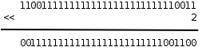
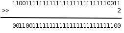

# 1. 位运算

整数在计算机中用二进制的位来表示，C语言提供一些运算符可以直接操作整数中的位，称为位运算，这些运算符的操作数都必须是整型的。在以后的学习中你会发现，有些信息利用整数中的某几个位来存储，要访问这些位，仅仅有对整数的操作是不够的，必须借助位运算，例如第2节"Unicode和UTF-8"介绍的UTF-8编码就是如此，学完本节之后你应该能自己写出UTF-8的编码和解码程序。本节首先介绍各种位运算符，然后介绍与位运算有关的编程技巧。

## 1.1. 按位与、或、异或、取反运算

在第3节"布尔代数"讲过逻辑与、或、非运算，并列出了真值表，对于整数中的位也可以做与、或、非运算，C语言提供了按位与（Bitwise AND）运算符&、按位或（Bitwise OR）运算符|和按位取反（Bitwise NOT）运算符~，此外还有按位异或（Bitwise XOR）运算符^，我们在第1节"为什么计算机用二进制计数"讲过异或运算。下面用二进制的形式举几个例子。


注意，&、|、^运算符都是要做Usual Arithmetic Conversion的（其中有一步是Integer Promotion），~运算符也要做Integer Promotion，所以在C语言中其实并不存在8位整数的位运算，操作数在做位运算之前都至少被提升为`int`型了，上面用8位整数举例只是为了书写方便。比如：

```c
unsigned char c = 0xfc;
unsigned int i = ~c;
```

计算过程是这样的：常量0xfc是`int`型的，赋给`c`要转成`unsigned char`，值不变；`c`的十六进制表示是fc，计算`~c`时先提升为整型（000000fc）然后取反，最后结果是ffffff03。注意，如果把`~c`看成是8位整数的取反，最后结果就得3了，这就错了。为了避免出错，一是尽量避免不同类型之间的赋值，二是每一步计算都要按上一章讲的类型转换规则仔细检查。

## 1.2. 移位运算

移位运算符（Bitwise Shift）包括左移<<和右移>>。左移将一个整数的各二进制位全部左移若干位，例如0xcfffffff3<<2得到0x3fffffcc：



最高两位的11被移出去了，最低两位又补了两个0，其它位依次左移两位。但要注意，移动的位数必须小于左操作数的总位数，比如上面的例子，左边是`unsigned int`型，如果左移的位数大于等于32位，则结果是Undefined。移位运算符不同于+ - * / ==等运算符，两边操作数的类型不要求一致，但两边操作数都要做Integer Promotion，整个表达式的类型和左操作数提升后的类型相同。

复习一下第2节"不同进制之间的换算"讲过的知识可以得出结论，**在一定的取值范围内，将一个整数左移1位相当于乘以2**。比如二进制11（十进制3）左移一位变成110，就是6，再左移一位变成1100，就是12。读者可以自己验证这条规律对有符号数和无符号数都成立，对负数也成立。当然，如果左移改变了最高位（符号位），那么结果肯定不是乘以2了，所以我加了个前提"在一定的取值范围内"。由于计算机做移位比做乘法快得多，编译器可以利用这一点做优化，比如看到源代码中有`i * 8`，可以编译成移位指令而不是乘法指令。

当操作数是无符号数时，右移运算的规则和左移类似，例如0xcfffffff3>>2得到0x33fffffc：



最低两位的11被移出去了，最高两位又补了两个0，其它位依次右移两位。和左移类似，移动的位数也必须小于左操作数的总位数，否则结果是Undefined。在一定的取值范围内，将一个整数右移1位相当于除以2，小数部分截掉。

当操作数是有符号数时，右移运算的规则比较复杂：

- 如果是正数，那么高位移入0
- 如果是负数，那么高位移入1还是0不一定，这是Implementation-defined的。对于x86平台的`gcc`编译器，最高位移入1，也就是仍保持负数的符号位，这种处理方式对负数仍然保持了"右移1位相当于除以2"的性质。

综上所述，由于类型转换和移位等问题，用有符号数做位运算是很不方便的，所以，**建议只对无符号数做位运算，以减少出错的可能**。

### 习题

1、下面两行`printf`打印的结果有何不同？请读者比较分析一下。`%x`转换说明的含义详见第2.9节"格式化I/O函数"。

```c
int i = 0xcffffff3;
printf("%x\n", 0xcffffff3>>2);
printf("%x\n", i>>2);
```

## 1.3. 掩码

如果要对一个整数中的某些位进行操作，怎样表示这些位在整数中的位置呢？可以用掩码（Mask）来表示。比如掩码0x0000ff00表示对一个32位整数的8~15位进行操作，举例如下。

1、取出8~15位。

```c
unsigned int a, b, mask = 0x0000ff00;
a = 0x12345678;
b = (a & mask) >> 8; /* 0x00000056 */
```

这样也可以达到同样的效果：

```c
b = (a >> 8) & ~(~0U << 8);
```

2、将8~15位清0。

```c
unsigned int a, b, mask = 0x0000ff00;
a = 0x12345678;
b = a & ~mask; /* 0x12340078 */
```

3、将8~15位置1。

```c
unsigned int a, b, mask = 0x0000ff00;
a = 0x12345678;
b = a | mask; /* 0x1234ff78 */
```

### 习题

1、统计一个无符号整数的二进制表示中1的个数，函数原型是`int countbit(unsigned int x);`。

2、用位操作实现无符号整数的乘法运算，函数原型是`unsigned int multiply(unsigned int x, unsigned int y);`。例如：(11011)₂×(10010)₂=((11011)₂<<1)+((11011)₂<<4)。

3、对一个32位无符号整数做循环右移，函数原型是`unsigned int rotate_right(unsigned int x);`。所谓循环右移就是把低位移出去的部分再补到高位上去，例如`rotate_right(0xdeadbeef, 16)`的值应该是0xefdeadbe。

## 1.4. 异或运算的一些特性

1、一个数和自己做异或的结果是0。如果需要一个常数0，x86平台的编译器可能会生成这样的指令：`xorl %eax, %eax`。不管`eax`寄存器里的值原来是多少，做异或运算都能得到0，这条指令比同样效果的`movl $0, %eax`指令快，因为前者只需要在CPU内部计算，而后者需要访问内存，在下一章第5节"Memory Hierarchy"详细介绍。

2、从异或的真值表可以看出，不管是0还是1，和0做异或保持原值不变，和1做异或得到原值的相反值。可以利用这个特性配合掩码实现某些位的翻转，例如：

```c
unsigned int a, b, mask = 1U << 6;
a = 0x12345678;
b = a ^ mask; /* flip the 6th bit */
```

3、如果a₁ ^ a₂ ^ a₃ ^ ... ^ aₙ的结果是1，则表示a₁、a₂、a₃...aₙ之中1的个数为奇数个，否则为偶数个。这条性质可用于奇偶校验（Parity Check），比如在串口通信过程中，每个字节的数据都计算一个校验位，数据和校验位一起发送出去，这样接收方可以根据校验位粗略地判断接收到的数据是否有误。

4、x ^ x ^ y == y，因为x ^ x == 0，0 ^ y == y。这个性质有什么用呢？我们来看这样一个问题：交换两个变量的值，不得借助额外的存储空间，所以就不能采用`temp = a; a = b; b = temp;`的办法了。利用位运算可以这样做交换：

```c
a = a ^ b;
b = b ^ a;
a = a ^ b;
```

分析一下这个过程。为了避免混淆，把a和b的初值分别记为a₀和b₀。第一行，`a = a₀ ^ b₀`；第二行，把a的新值代入，得到`b = b₀ ^ a₀ ^ b₀`，等号右边的b₀相当于上面公式中的x，a₀相当于y，所以结果为a₀；第三行，把a和b的新值代入，得到`a = a₀ ^ b₀ ^ a₀`，结果为b₀。注意这个过程不能把同一个变量自己跟自己交换，而利用中间变量`temp`则可以交换。

### 习题

1、请在网上查找有关RAID（Redundant Array of Independent Disks，独立磁盘冗余阵列）的资料，理解其实现原理，其实就是利用了本节的性质3和4。

2、交换两个变量的值，不得借助额外的存储空间，除了本节讲的方法之外你还能想出什么方法？本节讲的方法不能把同一个变量自己跟自己交换，你的方法有没有什么局限性？

---

[上一章](../ch15/index.md) | [目录](../index.md) | [下一节](./s02.md) 