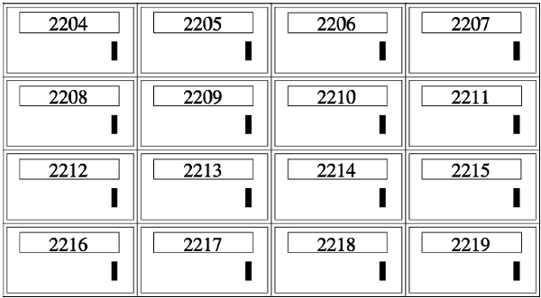

# 1. 内存与地址

我们都见过像这样挂在墙上的很多个邮箱，每个邮箱有一个房间编号，根据房间编号找到相应的邮箱投入信件或取出信件。内存与此类似，每个内存单元有一个地址（Address），内存地址是从0开始编号的整数，CPU通过地址找到相应的内存单元，取其中的指令或者读写其中的数据。与邮箱不同的是，一个地址所对应的内存单元不能存很多东西，只能存一个字节，以前讲过的`int`、`float`等多字节的数据类型保存在内存中要占用连续的多个地址，这种情况下数据的地址是它所占内存单元的起始地址。

---

[上一节](../ch17/index.md) | [目录](../index.md) | [下一节](./s02.md) 