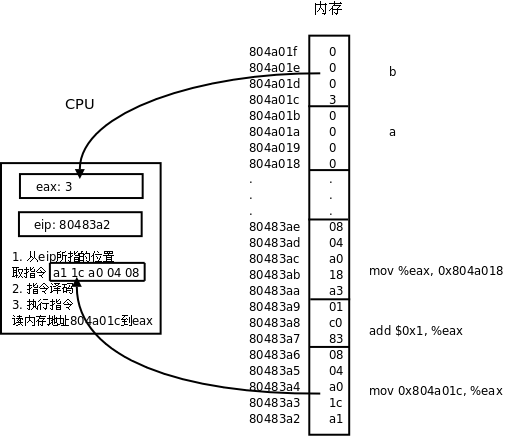

# 2. CPU

CPU总是周而复始地做同一件事：从内存取指令，然后解释执行它，然后再取下一条指令，再解释执行。CPU最核心的功能单元包括：

- 寄存器（Register），是CPU内部的高速存储器，像内存一样可以存取数据，但比访问内存快得多。随后的几章我们会详细介绍x86的寄存器`eax`、`esp`、`eip`等等，有些寄存器只能用于某种特定的用途，比如`eip`用作程序计数器，这称为特殊寄存器（Special-purpose Register），而另外一些寄存器可以用在各种运算和读写内存的指令中，比如`eax`寄存器，这称为通用寄存器（General-purpose Register）。

- 程序计数器（PC，Program Counter），是一种特殊寄存器，保存着CPU取下一条指令的地址，CPU按程序计数器保存的地址去内存中取指令然后解释执行，这时程序计数器保存的地址会自动加上该指令的长度，指向内存中的下一条指令。

- 指令译码器（Instruction Decoder）。CPU取上来的指令由若干个字节组成，这些字节中有些位表示内存地址，有些位表示寄存器编号，有些位表示这种指令做什么操作，是加减乘除还是读写内存，指令译码器负责解释这条指令的含义，然后调动相应的执行单元去执行它。

- 算术逻辑单元（ALU，Arithmetic and Logic Unit）。如果译码器将一条指令解释为运算指令，就调动算术逻辑单元去做运算，比如加减乘除、位运算、逻辑运算。指令中会指示运算结果保存到哪里，可能保存到寄存器中，也可能保存到内存中。

- 地址和数据总线（Bus）。CPU和内存之间用地址总线、数据总线和控制线连接起来，每条线上有1和0两种状态。如果在执行指令过程中需要访问内存，比如从内存读一个数到寄存器，执行过程可以想像成这样：

1. CPU内部将寄存器对接到数据总线上，使寄存器的每一位对接到一条数据线，等待接收数据。
2. CPU通过控制线发一个读请求，并且将内存地址通过地址线发给内存。
3. 内存收到地址和读请求之后，将相应的内存单元对接到数据总线的另一端，这样，内存单元每一位的1或0状态通过一条数据线到达CPU寄存器中相应的位，就完成了数据传送。

往内存里写数据的过程与此类似，只是数据线上的传输方向相反。

上图中画了32条地址线和32条数据线，CPU寄存器也是32位，可以说这种体系结构是32位的，比如x86就是这样的体系结构，目前主流的处理器是32位或64位的。地址线、数据线和CPU寄存器的位数通常是一致的，从上图可以看出数据线和CPU寄存器的位数应该一致，另外有些寄存器（比如程序计数器）需要保存一个内存地址，因而地址线和CPU寄存器的位数也应该一致。处理器的位数也称为字长，字（Word）这个概念用得比较混乱，在有些上下文中指16位，在有些上下文中指32位（这种情况下16位被称为半字Half Word），在有些上下文中指处理器的字长，如果处理器是32位那么一个字就是32位，如果处理器是64位那么一个字就是64位。32位计算机有32条地址线，地址空间（Address Space）从0x00000000到0xffffffff，共4GB，而64位计算机有更大的地址空间。

最后还要说明一点，本节所说的地址线、数据线是指CPU的内总线，是直接和CPU的执行单元相连的，内总线经过MMU和总线接口的转换之后引出到芯片引脚才是外总线，外地址线和外数据线的位数都有可能和内总线不同，例如32位处理器的外地址总线可寻址的空间可以大于4GB，到[第4节 "MMU"](./s04.md#arch.mmu)再详细解释。

我们结合[表1.1 "一个语句的三种表示"](../intro/program.md#intro.instruction)看一下CPU取指执行的过程。

1. `eip`寄存器指向地址0x80483a2，CPU从这里开始取一条5个字节的指令，然后`eip`寄存器指向下一条指令的起始地址0x80483a7。
2. CPU对这5个字节译码，得知这条指令要求从地址0x804a01c开始取4个字节保存到`eax`寄存器。
3. 执行指令，读内存，取上来的数是3，保存到`eax`寄存器。注意，地址0x804a01c~0x804a01f里存储的四个字节不能按地址从低到高的顺序看成0x03000000，而要按地址从高到低的顺序看成0x00000003。也就是说，对于多字节的整数类型，低地址保存的是整数的低位，这称为小端（Little Endian）字节序（Byte Order）。x86平台是小端字节序的，而另外一些平台规定低地址保存整数的高位，称为大端（Big Endian）字节序。
4. CPU从`eip`寄存器指向的地址取一条3个字节的指令，然后`eip`寄存器指向下一条指令的起始地址0x80483aa。
5. CPU对这3个字节译码，得知这条指令要求把`eax`寄存器的值加1，结果仍保存到`eax`寄存器。
6. 执行指令，现在`eax`寄存器中的数是4。
7. CPU从`eip`寄存器指向的地址取一条5个字节的指令，然后`eip`寄存器指向下一条指令的起始地址0x80483af。
8. CPU对这5个字节译码，得知这条指令要求把`eax`寄存器的值保存到从地址0x804a018开始的4个字节。
9. 执行指令，把4这个值保存到从地址0x804a018开始的4个字节（按小端字节序保存）。

---

[上一节](./s01.md) | [目录](../index.md) | [下一节](./s03.md) 