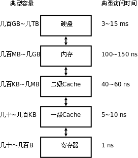

# 5. Memory Hierarchy

硬盘、内存、CPU寄存器，还有本节要讲的Cache，这些都是存储器，计算机为什么要有这么多种存储器呢？这些存储器各自有什么特点？这是本节要讨论的问题。

由于硬件技术的限制，我们可以制造出容量很小但很快的存储器，也可以制造出容量很大但很慢的存储器，但不可能两边的好处都占着，不可能制造出访问速度又快容量又大的存储器。因此，现代计算机都把存储器分成若干级，称为Memory Hierarchy，按照离CPU由近到远的顺序依次是CPU寄存器、Cache、内存、硬盘，越靠近CPU的存储器容量越小但访问速度越快，下图给出了各种存储器的容量和访问速度的典型值。

| 存储器类型 | 位于哪里 | 存储容量 | 半导体工艺 | 访问时间 | 如何访问 |
|------------|----------|----------|------------|----------|----------|
| CPU寄存器 | 位于CPU执行单元中。 | CPU寄存器通常只有几个到几十个，每个寄存器的容量取决于CPU的字长，所以一共只有几十到几百字节。 | "寄存器"这个名字就是一种数字电路的名字，它由一组触发器（Flip-flop）组成，每个触发器保存一个Bit的数据，可以做存取和移位等操作。计算机掉电时寄存器中保存的数据会丢失。 | 寄存器是访问速度最快的存储器，典型的访问时间是几纳秒。 | 使用哪个寄存器，如何使用寄存器，这些都是由指令决定的。 |
| Cache | 和MMU一样位于CPU核中。 | Cache通常分为几级，最典型的是如上图所示的两级Cache，一级Cache更靠近CPU执行单元，二级Cache更靠近物理内存，通常一级Cache有几十到几百KB，二级Cache有几百KB到几MB。 | Cache和内存都是由RAM（Random Access Memory）组成的，可以根据地址随机访问，计算机掉电时RAM中保存的数据会丢失。不同的是，Cache通常由SRAM（Static RAM，静态RAM）组成，而内存通常由DRAM（Dynamic RAM，动态RAM）组成。DRAM电路比SRAM简单，存储容量可以做得更大，但DRAM的访问速度比SRAM慢。 | 典型的访问时间是几十纳秒。 | Cache缓存最近访问过的内存数据，由于Cache的访问速度是内存的几十倍，所以有效利用Cache可以大大提高计算机的整体性能。一级Cache是这样工作的：CPU执行单元要访问内存时首先发出VA，Cache利用VA查找相应的数据有没有被缓存，如果Cache中有就不需要访问物理内存了，如果是读操作就直接将Cache中的数据传给CPU寄存器，如果是写操作就直接改写到Cache中；如果Cache没有缓存该数据，就去物理内存中取数据，但并不是要哪个字节就取哪个字节，而是把相邻的几十个字节都取上来缓存着，以备下次用到，这称为一个Cache Line，典型的Cache Line大小是32~256字节。如果计算机还配置了二级缓存，则在访问物理内存之前先用PA去二级缓存中查找。一级缓存是用VA寻址的，二级缓存是用PA寻址的，这是它们的区别。Cache所做的工作是由硬件自动完成的，而不是像寄存器一样由指令决定先做什么后做什么。 |
| 内存 | 位于CPU外的芯片，与CPU通过地址和数据总线相连。 | 典型的存储容量是几百MB到几GB。 | 由DRAM组成，详见上面关于Cache的说明。 | 典型的访问时间是几百纳秒。 | 内存是通过地址来访问的，在启用MMU的情况下，程序指令中的地址是VA，而访问内存用的是PA，它们之间的映射关系由操作系统维护。 |
| 硬盘 | 位于设备总线上，并不直接和CPU相连，CPU通过设备总线的控制器访问硬盘。 | 典型的存储容量是几百GB到几TB。 | 硬盘由磁性介质和磁头组成，访问硬盘时存在机械运动，磁头要移动，磁性介质要旋转，机械运动的速度很难提高到电子的速度，所以访问速度很受限制。保存在硬盘上的数据掉电后不会丢失。 | 典型的访问时间是几毫秒，是寄存器访问时间的10^6倍。 | 由驱动程序操作设备总线控制器去访问。由于硬盘的访问速度较慢，操作系统通常一次从硬盘上读几个页面到内存中缓存起来，如果这几个页面后来都被程序访问到了，那么这一次读硬盘的时间就可以分摊（Amortize）给程序的多次访问了。 |

对这个表格总结如下：

- 寄存器、Cache和内存中的数据都是掉电丢失的，这称为易失性存储器（Volatile Memory），与之相对的，硬盘是一种非易失性存储器（Non-volatile Memory）。

- 除了访问寄存器由程序指令直接控制之外，访问其它存储器都不是由指令直接控制的，有些是硬件自动完成的，有些是操作系统配合硬件完成的。

- Cache从内存取数据时会预取一个Cache Line缓存起来，操作系统从硬盘读数据时会预读几个页面缓存起来，都是希望这些数据以后会被程序访问到。大多数程序的行为都具有局部性（Locality）的特点：它们会花费大量的时间反复执行一小段代码（例如循环），或者反复访问一个很小的地址范围中的数据（例如访问一个数组）。所以预读缓存的办法是很有效的：CPU取一条指令，我把和它相邻的指令也都缓存起来，CPU很可能马上就会取到；CPU访问一个数据，我把和它相邻的数据也都缓存起来，CPU很可能马上就会访问到。设想有两台计算机，一台有256KB的Cache，另一台没有Cache，两台计算机的内存都是512MB的，硬盘都是100GB的，虽然多出来256KB的Cache与内存、硬盘的容量相比微不足道，但访问Cache比访问内存、硬盘快几个数量级，由于局部性原理，CPU大部分时间是在和Cache打交道，有Cache的计算机明显会快很多。高速存储器的容量只能做得很小，却能显著提升计算机的性能，这就是Memory Hierarchy的意义所在。

---

[上一节](./s04.md) | [目录](../index.md) | [下一章](../ch18/index.md) 