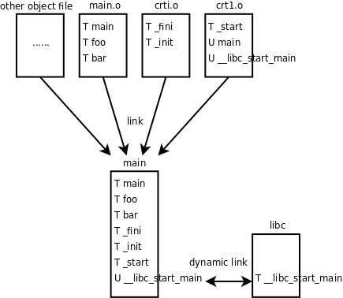

# 2. main函数和启动例程

为什么汇编程序的入口是`_start`，而C程序的入口是`main`函数呢？本节就来解释这个问题。在讲[例 18.1 "最简单的汇编程序"](../ch18/s01)时，我们的汇编和链接步骤是：

```bash
$ as hello.s -o hello.o
$ ld hello.o -o hello
```

以前我们常用`gcc main.c -o main`命令编译一个程序，其实也可以分三步做，第一步生成汇编代码，第二步生成目标文件，第三步生成可执行文件：

```bash
$ gcc -S main.c
$ gcc -c main.s
$ gcc main.o
```

`-S`选项生成汇编代码，`-c`选项生成目标文件，此外在[第 2 节 "数组应用实例：统计随机数"](../ch08/s02)还讲过`-E`选项只做预处理而不编译，如果不加这些选项则`gcc`执行完整的编译步骤，直到最后链接生成可执行文件为止。如下图所示。


这些选项都可以和`-o`搭配使用，给输出的文件重新命名而不使用`gcc`默认的文件名（`xxx.c`、`xxx.s`、`xxx.o`和`a.out`），例如`gcc main.o -o main`将`main.o`链接成可执行文件`main`。先前由汇编代码[例 18.1 "最简单的汇编程序"](../ch18/s01)生成的目标文件`hello.o`我们是用`ld`来链接的，可不可以用`gcc`链接呢？试试看。

```bash
$ gcc hello.o -o hello
hello.o: In function `_start':
(.text+0x0): multiple definition of `_start'
/usr/lib/gcc/i486-linux-gnu/4.3.2/../../../../lib/crt1.o:(.text+0x0): first defined here
/usr/lib/gcc/i486-linux-gnu/4.3.2/../../../../lib/crt1.o: In function `_start':
(.text+0x18): undefined reference to `main'
collect2: ld returned 1 exit status
```

提示两个错误：一是`_start`有多个定义，一个定义是由我们的汇编代码提供的，另一个定义来自`/usr/lib/crt1.o`；二是`crt1.o`的`_start`函数要调用`main`函数，而我们的汇编代码中没有提供`main`函数的定义。从最后一行还可以看出这些错误提示是由`ld`给出的。由此可见，如果我们用`gcc`做链接，`gcc`其实是调用`ld`将目标文件`crt1.o`和我们的`hello.o`链接在一起。`crt1.o`里面已经提供了`_start`入口点，我们的汇编程序中再实现一个`_start`就是多重定义了，链接器不知道该用哪个，只好报错。另外，`crt1.o`提供的`_start`需要调用`main`函数，而我们的汇编程序中没有实现`main`函数，所以报错。

如果目标文件是由C代码编译生成的，用`gcc`做链接就没错了，整个程序的入口点是`crt1.o`中提供的`_start`，它首先做一些初始化工作（以下称为启动例程，Startup Routine），然后调用C代码中提供的`main`函数。所以，以前我们说`main`函数是程序的入口点其实不准确，`_start`才是真正的入口点，而`main`函数是被`_start`调用的。

我们继续研究上一节的[例 19.1 "研究函数的调用过程"](s01)。如果分两步编译，第二步`gcc main.o -o main`其实是调用`ld`做链接的，相当于这样的命令：

```bash
$ ld /usr/lib/crt1.o /usr/lib/crti.o main.o -o main -lc -dynamic-linker /lib/ld-linux.so.2
```

也就是说，除了`crt1.o`之外其实还有`crti.o`，这两个目标文件和我们的`main.o`链接在一起生成可执行文件`main`。`-lc`表示需要链接`libc`库，在[第 1 节 "数学函数"](../ch03/s01)讲过`-lc`选项是`gcc`默认的，不用写，而对于`ld`则不是默认选项，所以要写上。`-dynamic-linker /lib/ld-linux.so.2`指定动态链接器是`/lib/ld-linux.so.2`，稍后会解释什么是动态链接。

那么`crt1.o`和`crti.o`里面都有什么呢？我们可以用`readelf`命令查看。在这里我们只关心符号表，如果只看符号表，可以用`readelf`命令的`-s`选项，也可以用`nm`命令。

```bash
$ nm /usr/lib/crt1.o 
00000000 R _IO_stdin_used
00000000 D __data_start
         U __libc_csu_fini
         U __libc_csu_init
         U __libc_start_main
00000000 R _fp_hw
00000000 T _start
00000000 W data_start
         U main
$ nm /usr/lib/crti.o
         U _GLOBAL_OFFSET_TABLE_
         w __gmon_start__
00000000 T _fini
00000000 T _init
```

`U main`这一行表示`main`这个符号在`crt1.o`中用到了，但是没有定义（U表示Undefined），因此需要别的目标文件提供一个定义并且和`crt1.o`链接在一起。具体来说，在`crt1.o`中要用到`main`这个符号所代表的地址，例如有一条指令是`push $符号main所代表的地址`，但不知道这个地址是多少，所以在`crt1.o`中这条指令暂时写成`push $0x0`，等到和`main.o`链接成可执行文件时就知道这个地址是多少了，比如是0x80483c4，那么可执行文件`main`中的这条指令就被链接器改成了`push $0x80483c4`。链接器在这里起到符号解析（Symbol Resolution）的作用，在[第 5.2 节 "可执行文件"](../ch18/s05)我们看到链接器起到重定位的作用，这两种作用都是通过修改指令中的地址实现的，链接器也是一种编辑器，`vi`和`emacs`编辑的是源文件，而链接器编辑的是目标文件，所以链接器也叫Link Editor。`T _start`这一行表示`_start`这个符号在`crt1.o`中提供了定义，这个符号的类型是代码（T表示Text）。我们从上面的输出结果中选取几个符号用图示说明它们之间的关系：



其实上面我们写的`ld`命令做了很多简化，`gcc`在链接时还用到了另外几个目标文件，所以上图多画了一个框，表示组成可执行文件`main`的除了`main.o`、`crt1.o`和`crti.o`之外还有其它目标文件，本书不做深入讨论，用`gcc`的`-v`选项可以了解详细的编译过程：

```bash
$ gcc -v main.c -o main
Using built-in specs.
Target: i486-linux-gnu
...
 /usr/lib/gcc/i486-linux-gnu/4.3.2/cc1 -quiet -v main.c -D_FORTIFY_SOURCE=2 -quiet -dumpbase main.c -mtune=generic -auxbase main -version -fstack-protector -o /tmp/ccRGDpua.s
...
 as -V -Qy -o /tmp/ccidnZ1d.o /tmp/ccRGDpua.s
...
 /usr/lib/gcc/i486-linux-gnu/4.3.2/collect2 --eh-frame-hdr -m elf_i386 --hash-style=both -dynamic-linker /lib/ld-linux.so.2 -o main -z relro /usr/lib/gcc/i486-linux-gnu/4.3.2/../../../../lib/crt1.o /usr/lib/gcc/i486-linux-gnu/4.3.2/../../../../lib/crti.o /usr/lib/gcc/i486-linux-gnu/4.3.2/crtbegin.o -L/usr/lib/gcc/i486-linux-gnu/4.3.2 -L/usr/lib/gcc/i486-linux-gnu/4.3.2 -L/usr/lib/gcc/i486-linux-gnu/4.3.2/../../../../lib -L/lib/../lib -L/usr/lib/../lib -L/usr/lib/gcc/i486-linux-gnu/4.3.2/../../.. /tmp/ccidnZ1d.o -lgcc --as-needed -lgcc_s --no-as-needed -lc -lgcc --as-needed -lgcc_s --no-as-needed /usr/lib/gcc/i486-linux-gnu/4.3.2/crtend.o /usr/lib/gcc/i486-linux-gnu/4.3.2/../../../../lib/crtn.o
```

链接生成的可执行文件`main`中包含了各目标文件所定义的符号，通过反汇编可以看到这些符号的定义：

```bash
$ objdump -d main
main:     file format elf32-i386


Disassembly of section .init:

08048274 <_init>:
 8048274:	55                   	push   %ebp
 8048275:	89 e5                	mov    %esp,%ebp
 8048277:	53                   	push   %ebx
...
Disassembly of section .text:

080482e0 <_start>:
 80482e0:	31 ed                	xor    %ebp,%ebp
 80482e2:	5e                   	pop    %esi
 80482e3:	89 e1                	mov    %esp,%ecx
...
08048394 <bar>:
 8048394:	55                   	push   %ebp
 8048395:	89 e5                	mov    %esp,%ebp
 8048397:	83 ec 10             	sub    $0x10,%esp
...
080483aa <foo>:
 80483aa:	55                   	push   %ebp
 80483ab:	89 e5                	mov    %esp,%ebp
 80483ad:	83 ec 08             	sub    $0x8,%esp
...
080483c4 <main>:
 80483c4:	8d 4c 24 04          	lea    0x4(%esp),%ecx
 80483c8:	83 e4 f0             	and    $0xfffffff0,%esp
 80483cb:	ff 71 fc             	pushl  -0x4(%ecx)
...
Disassembly of section .fini:

0804849c <_fini>:
 804849c:	55                   	push   %ebp
 804849d:	89 e5                	mov    %esp,%ebp
 804849f:	53                   	push   %ebx
```

`crt1.o`中的未定义符号`main`在`main.o`中定义了，所以链接在一起就没问题了。`crt1.o`还有一个未定义符号`__libc_start_main`在其它几个目标文件中也没有定义，所以在可执行文件`main`中仍然是个未定义符号。这个符号是在`libc`中定义的，`libc`并不像其它目标文件一样链接到可执行文件`main`中，而是在运行时做动态链接：

1. 操作系统在加载执行`main`这个程序时，首先查看它有没有需要动态链接的未定义符号。

2. 如果需要做动态链接，就查看这个程序指定了哪些共享库（我们用`-lc`指定了`libc`）以及用什么动态链接器来做动态链接（我们用`-dynamic-linker /lib/ld-linux.so.2`指定了动态链接器）。

3. 动态链接器在共享库中查找这些符号的定义，完成链接过程。

了解了这些原理之后，现在我们来看`_start`的反汇编：

```bash
...
Disassembly of section .text:

080482e0 <_start>:
 80482e0:       31 ed                   xor    %ebp,%ebp
 80482e2:       5e                      pop    %esi
 80482e3:       89 e1                   mov    %esp,%ecx
 80482e5:       83 e4 f0                and    $0xfffffff0,%esp
 80482e8:       50                      push   %eax
 80482e9:       54                      push   %esp
 80482ea:       52                      push   %edx
 80482eb:       68 00 84 04 08          push   $0x8048400
 80482f0:       68 10 84 04 08          push   $0x8048410
 80482f5:       51                      push   %ecx
 80482f6:       56                      push   %esi
 80482f7:       68 c4 83 04 08          push   $0x80483c4
 80482fc:       e8 c3 ff ff ff          call   80482c4 <__libc_start_main@plt>
...
```

首先将一系列参数压栈，然后调用`libc`的库函数`__libc_start_main`做初始化工作，其中最后一个压栈的参数`push   $0x80483c4`是`main`函数的地址，`__libc_start_main`在完成初始化工作之后会调用`main`函数。由于`__libc_start_main`需要动态链接，所以这个库函数的指令在可执行文件`main`的反汇编中肯定是找不到的，然而我们找到了这个：

```bash
Disassembly of section .plt:
...
080482c4 <__libc_start_main@plt>:
 80482c4:       ff 25 04 a0 04 08       jmp    *0x804a004
 80482ca:       68 08 00 00 00          push   $0x8
 80482cf:       e9 d0 ff ff ff          jmp    80482a4 <_init+0x30>
```

这三条指令位于`.plt`段而不是`.text`段，`.plt`段协助完成动态链接的过程。我们将在下一章详细讲解动态链接的过程。

`main`函数最标准的原型应该是`int main(int argc, char *argv[])`，也就是说启动例程会传两个参数给`main`函数，这两个参数的含义我们学了指针以后再解释。我们到目前为止都把`main`函数的原型写成`int main(void)`，这也是C标准允许的，如果你认真分析了上一节的习题，你就应该知道，多传了参数而不用是没有问题的，少传了参数却用了则会出问题。

由于`main`函数是被启动例程调用的，所以从`main`函数`return`时仍返回到启动例程中，`main`函数的返回值被启动例程得到，如果将启动例程表示成等价的C代码（实际上启动例程一般是直接用汇编写的），则它调用`main`函数的形式是：

```c
exit(main(argc, argv));
```

也就是说，启动例程得到`main`函数的返回值后，会立刻用它做参数调用`exit`函数。`exit`也是`libc`中的函数，它首先做一些清理工作，然后调用上一章讲过的`_exit`系统调用终止进程，`main`函数的返回值最终被传给`_exit`系统调用，成为进程的退出状态。我们也可以在`main`函数中直接调用`exit`函数终止进程而不返回到启动例程，例如：

```c
#include <stdlib.h>

int main(void)
{
	exit(4);
}
```

这样和`int main(void) { return 4; }`的效果是一样的。在Shell中运行这个程序并查看它的退出状态：

```bash
$ ./a.out 
$ echo $?
4
```

按照惯例，退出状态为0表示程序执行成功，退出状态非0表示出错。注意，退出状态只有8位，而且被Shell解释成无符号数，如果将上面的代码改为`exit(-1);`或`return -1;`，则运行结果为

```bash
$ ./a.out 
$ echo $?
255
```

注意，如果声明一个函数的返回值类型是`int`，函数中每个分支控制流程必须写`return`语句指定返回值，如果缺了`return`则返回值不确定（想想这是为什么），编译器通常是会报警告的，但如果某个分支控制流程调用了`exit`或`_exit`而不写`return`，编译器是允许的，因为它都没有机会返回了，指不指定返回值也就无所谓了。使用`exit`函数需要包含头文件`stdlib.h`，而使用`_exit`函数需要包含头文件`unistd.h`，以后还要详细解释这两个函数。

---

[上一节](s01) | [目录](../index) | [下一节](s03) 