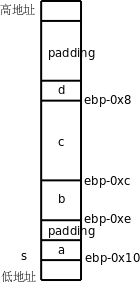
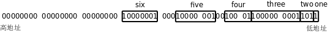

# 4. 结构体和联合体

我们继续用反汇编的方法研究一下C语言的结构体：

```c
#include <stdio.h>

int main(int argc, char** argv)
{
    struct {
        char a;
        short b;
        int c;
        char d;
    } s;

    s.a = 1;
    s.b = 2;
    s.c = 3;
    s.d = 4;
    printf("%u\n", sizeof(s));

    return 0;
}
```

`main`函数中几条语句的反汇编结果如下：

```bash
        s.a = 1;
 80483d5:       c6 45 f0 01             movb   $0x1,-0x10(%ebp)
        s.b = 2;
 80483d9:       66 c7 45 f2 02 00       movw   $0x2,-0xe(%ebp)
        s.c = 3;
 80483df:       c7 45 f4 03 00 00 00    movl   $0x3,-0xc(%ebp)
        s.d = 4;
 80483e6:       c6 45 f8 04             movb   $0x4,-0x8(%ebp)
```

从访问结构体成员的指令可以看出，结构体的四个成员在栈上是这样排列的：



虽然栈是从高地址向低地址增长的，但结构体成员也是从低地址向高地址排列的，这一点和数组类似。但有一点和数组不同，结构体的各成员并不是一个紧挨一个排列的，中间有空隙，称为填充（Padding），不仅如此，在这个结构体的末尾也有三个字节的填充，所以`sizeof(s)`的值是12。注意，`printf`的`%u`转换说明表示无符号数，`sizeof`的值是`size_t`类型的，是某种无符号整型。

为什么编译器要这样处理呢？有一个知识点我此前一直回避没讲，那就是大多数计算机体系统结构对于访问内存的指令是有限制的，在32位平台上，访问4字节的指令（比如上面的`movl`）所访问的内存地址应该是4的整数倍，访问两字节的指令（比如上面的`movw`）所访问的内存地址应该是两字节的整数倍，这称为对齐（Alignment）。以前举的所有例子中的内存访问指令都满足这个限制条件，读者可以回头检验一下。如果指令所访问的内存地址没有正确对齐会怎么样呢？在有些平台上将不能访问内存，而是引发一个异常，在x86平台上倒是仍然能访问内存，但是不对齐的指令执行效率比对齐的指令要低，所以编译器在安排各种变量的地址时都会考虑到对齐的问题。对于本例中的结构体，编译器会把它的基地址对齐到4字节边界，也就是说，`ebp-0x10`这个地址一定是4的整数倍。`s.a`占一个字节，没有对齐的问题。`s.b`占两个字节，如果`s.b`紧挨在`s.a`后面，它的地址就不能是两字节的整数倍了，所以编译器会在结构体中插入一个填充字节，使`s.b`的地址也是两字节的整数倍。`s.c`占4字节，紧挨在`s.b`的后面就可以了，因为`ebp-0xc`这个地址也是4的整数倍。那么为什么`s.d`的后面也要有填充位填充到4字节边界呢？这是为了便于安排这个结构体后面的变量的地址，假如用这种结构体类型组成一个数组，那么后一个结构体只需和前一个结构体紧挨着排列就可以保证它的基地址仍然对齐到4字节边界了，因为在前一个结构体的末尾已经有了填充字节。事实上，C标准规定数组元素必须紧挨着排列，不能有空隙，这样才能保证每个元素的地址可以按"基地址+n×元素大小"简单计算出来。

合理设计结构体各成员的排列顺序可以节省存储空间，例如上例中的结构体改成这样就可以避免产生填充字节：

```c
struct {
    char a;
    char d;
    short b;
    int c;
} s;
```

此外，`gcc`提供了一种扩展语法可以消除结构体中的填充字节：

```c
struct {
    char a;
    short b;
    int c;
    char d;
} __attribute__((packed)) s;
```

这样就不能保证结构体成员的对齐了，在访问`b`和`c`的时候可能会有效率问题，所以除非有特别的理由，一般不要使用这种语法。

以前我们使用的数据类型都是占几个字节，最小的类型也要占一个字节，而在结构体中还可以使用Bit-field语法定义只占几个bit的成员。下面这个例子出自王聪的网站（www.wangcong.org）：

```c
#include <stdio.h>

typedef struct {
    unsigned int one:1;
    unsigned int two:3;
    unsigned int three:10;
    unsigned int four:5;
    unsigned int :2;
    unsigned int five:8;
    unsigned int six:8;
} demo_type;

int main(void)
{
    demo_type s = { 1, 5, 513, 17, 129, 0x81 };
    printf("sizeof demo_type = %u\n", sizeof(demo_type));
    printf("values: s=%u,%u,%u,%u,%u,%u\n",
           s.one, s.two, s.three, s.four, s.five, s.six);

    return 0;
}
```

`s`这个结构体的布局如下图所示：



Bit-field成员的类型可以是`int`或`unsigned int`，表示有符号数或无符号数，但不表示它像普通的`int`型一样占4个字节，它后面的数字是几就表示它占多少个bit，也可以像`unsigned int :2;`这样定义一个未命名的Bit-field，即使不写未命名的Bit-field，编译器也有可能在两个成员之间插入填充位，如上图的`five`和`six`之间，这样`six`这个成员就刚好单独占一个字节了，访问效率会比较高，这个结构体的末尾还填充了3个字节，以便对齐到4字节边界。以前我们说过x86的Byte Order是小端的，从上图中`one`和`two`的排列顺序可以看出，如果对一个字节再细分，则字节中的Bit Order也是小端的，因为排在结构体前面的成员（靠近低地址一边的成员）取字节中的低位。关于如何排列Bit-field在C标准中没有详细的规定，这跟Byte Order、Bit Order、对齐等问题都有关，不同的平台和编译器可能会排列得很不一样，要编写可移植的代码就不能假定Bit-field是按某一种固定方式排列的。Bit-field在驱动程序中是很有用的，因为经常需要单独操作设备寄存器中的一个或几个bit，但一定要小心使用，首先弄清楚每个Bit-field和实际bit的对应关系。

和前面几个例子不一样，在上例中我没有给出反汇编结果，直接画了个图说这个结构体的布局是这样的，那我有什么证据这么说呢？上例的反汇编结果比较繁琐，我们可以通过另一种手段得到这个结构体的内存布局。C语言还有一种类型叫联合体，用关键字`union`定义，其语法类似于结构体，例如：

```c
#include <stdio.h>

typedef union {
    struct {
        unsigned int one:1;
        unsigned int two:3;
        unsigned int three:10;
        unsigned int four:5;
        unsigned int :2;
        unsigned int five:8;
        unsigned int six:8;
    } bitfield;
    unsigned char byte[8];
} demo_type;

int main(void)
{
    demo_type u = {{ 1, 5, 513, 17, 129, 0x81 }};
    printf("sizeof demo_type = %u\n", sizeof(demo_type));
    printf("values: u=%u,%u,%u,%u,%u,%u\n",
           u.bitfield.one, u.bitfield.two, u.bitfield.three,
           u.bitfield.four, u.bitfield.five, u.bitfield.six);
    printf("hex dump of u: %x %x %x %x %x %x %x %x \n",
           u.byte[0], u.byte[1], u.byte[2], u.byte[3],
           u.byte[4], u.byte[5], u.byte[6], u.byte[7]);

    return 0;
}
```

一个联合体的各个成员占用相同的内存空间，联合体的长度等于其中最长成员的长度。比如`u`这个联合体占8个字节，如果访问成员`u.bitfield`，则把这8个字节看成一个由Bit-field组成的结构体，如果访问成员`u.byte`，则把这8个字节看成一个数组。联合体如果用Initializer初始化，则只初始化它的第一个成员，例如`demo_type u = {{ 1, 5, 513, 17, 129, 0x81 }};`初始化的是`u.bitfield`，但是通过`u.bitfield`的成员看不出这8个字节的内存布局，而通过`u.byte`数组就可以看出每个字节分别是多少了。

## 习题

1. 编写一个程序，测试运行它的平台是大端还是小端字节序。

---

[上一节](s03) | [目录](../index) | [下一节](s05) 