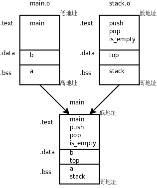

# 1. 多目标文件的链接

现在我们把[例 12.1 "用堆栈实现倒序打印"](../ch12/s02#stackqueue.stackreverse)拆成两个程序文件，`stack.c`实现堆栈，而`main.c`使用堆栈：

```c
/* stack.c */
char stack[512];
int top = -1;

void push(char c)
{
    stack[++top] = c;
}

char pop(void)
{
    return stack[top--];
}

int is_empty(void)
{
    return top == -1;
}
```

这段程序和原来有点不同，在[例 12.1 "用堆栈实现倒序打印"](../ch12/s02#stackqueue.stackreverse)中`top`总是指向栈顶元素的下一个元素，而在这段程序中`top`总是指向栈顶元素，所以要初始化成-1才表示空堆栈，这两种堆栈使用习惯都很常见。

```c
/* main.c */
#include <stdio.h>

int a, b = 1;

int main(void)
{
    push('a');
    push('b');
    push('c');
    
    while(!is_empty())
        putchar(pop());
    putchar('\n');

    return 0;
}
```

`a`和`b`这两个变量没有用，只是为了顺便说明链接过程才加上的。编译的步骤和以前一样，可以一步编译：

```bash
$ gcc main.c stack.c -o main
```

也可以分多步编译：

```bash
$ gcc -c main.c
$ gcc -c stack.c
$ gcc main.o stack.o -o main
```

如果按照[第 2 节 "main函数和启动例程"](../ch19/s02#asmc.main)的做法，用`nm`命令查看目标文件的符号表，会发现`main.o`中有未定义的符号`push`、`pop`、`is_empty`、`putchar`，前三个符号在`stack.o`中实现了，链接生成可执行文件`main`时可以做符号解析，而`putchar`是`libc`的库函数，在可执行文件`main`中仍然是未定义的，要在程序运行时做动态链接。

我们通过`readelf -a main`命令可以看到，`main`的`.bss`段合并了`main.o`和`stack.o`的`.bss`段，其中包含了变量`a`和`stack`，`main`的`.data`段也合并了`main.o`和`stack.o`的`.data`段，其中包含了变量`b`和`top`，`main`的`.text`段合并了`main.o`和`stack.o`的`.text`段，包含了各函数的定义。如下图所示。



为什么在可执行文件`main`的每个段中来自`main.o`的变量或函数都在前面，而来自`stack.o`的变量或函数都在后面呢？我们可以试试把`gcc`命令中的两个目标文件反过来写：

```bash
$ gcc stack.o main.o -o main
```

结果正如我们所预料的，可执行文件`main`的每个段中来自`main.o`的变量或函数都排到后面了。实际上链接的过程是由一个链接脚本（Linker Script）控制的，链接脚本决定了给每个段分配什么地址，如何对齐，哪个段在前，哪个段在后，哪些段合并到同一个Segment，另外链接脚本还要插入一些符号到最终生成的文件中，例如`__bss_start`、`_edata`、`_end`等。如果用`ld`做链接时没有用`-T`选项指定链接脚本，则使用`ld`的默认链接脚本，默认链接脚本可以用`ld --verbose`命令查看（由于比较长，只列出一些片断）：

```bash
$ ld --verbose
...
using internal linker script:
==================================================
/* Script for -z combreloc: combine and sort reloc sections */
OUTPUT_FORMAT("elf32-i386", "elf32-i386",
          "elf32-i386")
OUTPUT_ARCH(i386)
ENTRY(_start)
...
SECTIONS
{
  /* Read-only sections, merged into text segment: */
  PROVIDE (__executable_start = 0x08048000); . = 0x08048000 + SIZEOF_HEADERS;
  .interp         : { *(.interp) }
  .note.gnu.build-id : { *(.note.gnu.build-id) }
  .hash           : { *(.hash) }
  .gnu.hash       : { *(.gnu.hash) }
  .dynsym         : { *(.dynsym) }
  .dynstr         : { *(.dynstr) }
  .gnu.version    : { *(.gnu.version) }
  .gnu.version_d  : { *(.gnu.version_d) }
  .gnu.version_r  : { *(.gnu.version_r) }
  .rel.dyn        :
...
  .rel.plt        : { *(.rel.plt) }
...
  .init           :
...
  .plt            : { *(.plt) }
  .text           :
...
  .fini           :
...
  .rodata         : { *(.rodata .rodata.* .gnu.linkonce.r.*) }
...
  .eh_frame       : ONLY_IF_RO { KEEP (*(.eh_frame)) }
...
  /* Adjust the address for the data segment.  We want to adjust up to
     the same address within the page on the next page up.  */
  . = ALIGN (CONSTANT (MAXPAGESIZE)) - ((CONSTANT (MAXPAGESIZE) - .) & (CONSTANT (MAXPAGESIZE) - 1)); . = DATA_SEGMENT_ALIGN (CONSTANT (MAXPAGESIZE), CONSTANT (COMMONPAGESIZE));
...
  .ctors          :
...
  .dtors          :
...
  .jcr            : { KEEP (*(.jcr)) }
...
  .dynamic        : { *(.dynamic) }
  .got            : { *(.got) }
...
  .got.plt        : { *(.got.plt) }
  .data           :
...
  _edata = .; PROVIDE (edata = .);
  __bss_start = .;
  .bss            :
...
  _end = .; PROVIDE (end = .);
  . = DATA_SEGMENT_END (.);
  /* Stabs debugging sections.  */
...
  /* DWARF debug sections.
     Symbols in the DWARF debugging sections are relative to the beginning
     of the section so we begin them at 0.  */
...
}
==================================================
```

`ENTRY(_start)`说明`_start`是整个程序的入口点，因此`_start`是入口点并不是规定死的，是可以改用其它函数做入口点的。

`PROVIDE (__executable_start = 0x08048000); . = 0x08048000 + SIZEOF_HEADERS;`是Text Segment的起始地址，这个Segment包含后面列出的那些段，`.plt`、`.text`、`.rodata`等等。每个段的描述格式都是"段名 : { 组成 }"，例如`.plt : { *(.plt) }`，左边表示最终生成的文件的`.plt`段，右边表示所有目标文件的`.plt`段，意思是最终生成的文件的`.plt`段由各目标文件的`.plt`段组成。

`. = ALIGN (CONSTANT (MAXPAGESIZE)) - ((CONSTANT (MAXPAGESIZE) - .) & (CONSTANT (MAXPAGESIZE) - 1)); . = DATA_SEGMENT_ALIGN (CONSTANT (MAXPAGESIZE), CONSTANT (COMMONPAGESIZE));`是Data Segment的起始地址，要做一系列的对齐操作，这个Segment包含后面列出的那些段，`.got`、`.data`、`.bss`等等。

Data Segment的后面还有其它一些Segment，主要是调试信息。关于链接脚本就介绍这么多，本书不做深入讨论。 