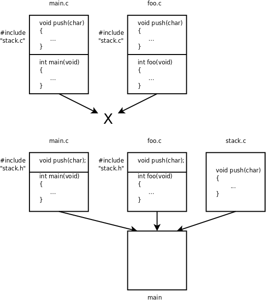

# 2. 定义和声明

## 2.1 extern和static关键字

在上一节我们把两个程序文件放在一起编译链接，`main.c`用到的函数`push`、`pop`和`is_empty`由`stack.c`提供，其实有一点小问题，我们用`-Wall`选项编译`main.c`可以看到：

```bash
$ gcc -c main.c -Wall
main.c: In function 'main':
main.c:8: warning: implicit declaration of function 'push'
main.c:12: warning: implicit declaration of function 'is_empty'
main.c:13: warning: implicit declaration of function 'pop'
```

这个问题我们在[第 2 节 "自定义函数"](../ch03/s02#func.ourfirstfunc)讨论过，由于编译器在处理函数调用代码时没有找到函数原型，只好根据函数调用代码做隐式声明，把这三个函数声明为：

```c
int push(char);
int pop(void);
int is_empty(void);
```

现在你应该比学[第 2 节 "自定义函数"](../ch03/s02#func.ourfirstfunc)的时候更容易理解这条规则了。为什么编译器在处理函数调用代码时需要有函数原型？因为必须知道参数的类型和个数以及返回值的类型才知道生成什么样的指令。为什么隐式声明靠不住呢？因为隐式声明是从函数调用代码推导而来的，而事实上函数定义的形参类型可能跟函数调用代码传的实参类型并不一致，如果函数定义带有可变参数（例如`printf`），那么从函数调用代码也看不出来这个函数带有可变参数，另外，从函数调用代码也看不出来返回值应该是什么类型，所以隐式声明只能规定返回值都是`int`型的。既然隐式声明靠不住，那编译器为什么不自己去找函数定义，而非要让我们在调用之前写函数原型呢？因为编译器往往不知道去哪里找函数定义，像上面的例子，我让编译器编译`main.c`，而这几个函数的定义却在`stack.c`里，编译器又怎么会知道呢？所以编译器只能通过隐式声明来猜测函数原型，这种猜测往往会出错，但在比较简单的情况下还算可用，比如上一节的例子这么编译过去了也能得到正确结果。

现在我们在`main.c`中声明这几个函数的原型：

```c
/* main.c */
#include <stdio.h>

extern void push(char);
extern char pop(void);
extern int is_empty(void);

int main(void)
{
    push('a');
    push('b');
    push('c');
    
    while(!is_empty())
        putchar(pop());
    putchar('\n');

    return 0;
}
```

这样编译器就不会报警告了。在这里`extern`关键字表示这个标识符具有External Linkage。External Linkage的定义在上一章讲过，但现在应该更容易理解了，`push`这个标识符具有External Linkage指的是：如果把`main.c`和`stack.c`链接在一起，如果`push`在`main.c`和`stack.c`中都有声明（在`stack.c`中的声明同时也是定义），那么这些声明指的是同一个函数，链接之后是同一个`GLOBAL`符号，代表同一个地址。函数声明中的`extern`也可以省略不写，不写`extern`的函数声明也表示这个函数具有External Linkage。

如果用`static`关键字修饰一个函数声明，则表示该标识符具有Internal Linkage，例如有以下两个程序文件：

```c
/* foo.c */
static void foo(void) {}
```

```c
/* main.c */
void foo(void);
int main(void) { foo(); return 0; }
```

编译链接在一起会出错：

```bash
$ gcc foo.c main.c
/tmp/ccRC2Yjn.o: In function `main':
main.c:(.text+0x12): undefined reference to `foo'
collect2: ld returned 1 exit status
```

虽然在`foo.c`中定义了函数`foo`，但这个函数只具有Internal Linkage，只有在`foo.c`中多次声明才表示同一个函数，而在`main.c`中声明就不表示它了。如果把`foo.c`编译成目标文件，函数名`foo`在其中是一个`LOCAL`的符号，不参与链接过程，所以在链接时，`main.c`中用到一个External Linkage的`foo`函数，链接器却找不到它的定义在哪儿，无法确定它的地址，也就无法做符号解析，只好报错。**凡是被多次声明的变量或函数，必须有且只有一个声明是定义，如果有多个定义，或者一个定义都没有，链接器就无法完成链接。**

以上讲了用`static`和`extern`修饰函数声明的情况。现在来看用它们修饰变量声明的情况。仍然用`stack.c`和`main.c`的例子，如果我想在`main.c`中直接访问`stack.c`中定义的变量`top`，则可以用`extern`声明它：

```c
/* main.c */
#include <stdio.h>

void push(char);
char pop(void);
int is_empty(void);
extern int top;

int main(void)
{
    push('a');
    push('b');
    push('c');
    printf("%d\n", top);
    
    while(!is_empty())
        putchar(pop());
    putchar('\n');
    printf("%d\n", top);

    return 0;
}
```

变量`top`具有External Linkage，它的存储空间是在`stack.c`中分配的，所以`main.c`中的变量声明`extern int top;`不是变量定义，因为它不分配存储空间。以上函数和变量声明也可以写在`main`函数体里面，使所声明的标识符具有块作用域：

```c
int main(void)
{
    void push(char);
    char pop(void);
    int is_empty(void);
    extern int top;

    push('a');
    push('b');
    push('c');
    printf("%d\n", top);
    
    while(!is_empty())
        putchar(pop());
    putchar('\n');
    printf("%d\n", top);

    return 0;
}
```

注意，变量声明和函数声明有一点不同，函数声明的`extern`可写可不写，而变量声明如果不写`extern`意思就完全变了，如果上面的例子不写`extern`就表示在`main`函数中定义一个局部变量`top`。另外要注意，`stack.c`中的定义是`int top = -1;`，而`main.c`中的声明不能加Initializer，如果上面的例子写成`extern int top = -1;`则编译器会报错。

在`main.c`中可以通过变量声明来访问`stack.c`中的变量`top`，但是从实现`stack.c`这个模块的角度来看，`top`这个变量是不希望被外界访问到的，变量`top`和`stack`都属于这个模块的内部状态，外界应该只允许通过`push`和`pop`函数来改变模块的内部状态，这样才能保证堆栈的LIFO特性，如果外界可以随机访问`stack`或者随便修改`top`，那么堆栈的状态就乱了。那怎么才能阻止外界访问`top`和`stack`呢？答案就是用`static`关键字把它们声明为Internal Linkage的：

```c
/* stack.c */
static char stack[512];
static int top = -1;

void push(char c)
{
    stack[++top] = c;
}

char pop(void)
{
    return stack[top--];
}

int is_empty(void)
{
    return top == -1;
}
```

这样，即使在`main.c`中用`extern`声明也访问不到`stack.c`的变量`top`和`stack`。从而保护了`stack.c`模块的内部状态，这也是一种封装（Encapsulation）的思想。

用`static`关键字声明具有Internal Linkage的函数也是出于这个目的。在一个模块中，有些函数是提供给外界使用的，也称为导出（Export）给外界使用，这些函数声明为External Linkage的。有些函数只在模块内部使用而不希望被外界访问到，则声明为Internal Linkage的。

## 2.2 头文件

我们继续前面关于`stack.c`和`main.c`的讨论。`stack.c`这个模块封装了`top`和`stack`两个变量，导出了`push`、`pop`、`is_empty`三个函数接口，已经设计得比较完善了。但是使用这个模块的每个程序文件都要写三个函数声明也是很麻烦的，假设又有一个`foo.c`也要使用这个模块，`main.c`和`foo.c`中各自要写三个函数声明。重复的代码总是应该尽量避免的，以前我们通过各种办法把重复的代码提取出来，比如在[第 2 节 "数组应用实例：统计随机数"](../ch08/s02#array.statistic)讲过用宏定义避免硬编码的问题，这次有什么办法呢？答案就是可以自己写一个头文件`stack.h`：

```c
/* stack.h */
#ifndef STACK_H
#define STACK_H
extern void push(char);
extern char pop(void);
extern int is_empty(void);
#endif
```

这样在`main.c`中只需包含这个头文件就可以了，而不需要写三个函数声明：

```c
/* main.c */
#include <stdio.h>
#include "stack.h"

int main(void)
{
    push('a');
    push('b');
    push('c');
    
    while(!is_empty())
        putchar(pop());
    putchar('\n');

    return 0;
}
```

首先说为什么`#include <stdio.h>`用角括号，而`#include "stack.h"`用引号。对于用角括号包含的头文件，`gcc`首先查找`-I`选项指定的目录，然后查找系统的头文件目录（通常是`/usr/include`，在我的系统上还包括`/usr/lib/gcc/i486-linux-gnu/4.3.2/include`）；而对于用引号包含的头文件，`gcc`首先查找包含头文件的`.c`文件所在的目录，然后查找`-I`选项指定的目录，然后查找系统的头文件目录。

假如三个代码文件都放在当前目录下：

```bash
$ tree
.
|-- main.c
|-- stack.c
`-- stack.h

0 directories, 3 files
```

则可以用`gcc -c main.c`编译，`gcc`会自动在`main.c`所在的目录中找到`stack.h`。假如把`stack.h`移到一个子目录下：

```bash
$ tree
.
|-- main.c
`-- stack
    |-- stack.c
    `-- stack.h

1 directory, 3 files
```

则需要用`gcc -c main.c -Istack`编译。用`-I`选项告诉`gcc`头文件要到子目录`stack`里找。

在`#include`预处理指示中可以使用相对路径，例如把上面的代码改成`#include "stack/stack.h"`，那么编译时就不需要加`-Istack`选项了，因为`gcc`会自动在`main.c`所在的目录中查找，而头文件相对于`main.c`所在目录的相对路径正是`stack/stack.h`。

在`stack.h`中我们又看到两个新的预处理指示`#ifndef STACK_H`和`#endif`，意思是说，如果`STACK_H`这个宏没有定义过，那么从`#ifndef`到`#endif`之间的代码就包含在预处理的输出结果中，否则这一段代码就不出现在预处理的输出结果中。`stack.h`这个头文件的内容整个被`#ifndef`和`#endif`括起来了，如果在包含这个头文件时`STACK_H`这个宏已经定义过了，则相当于这个头文件里什么都没有，包含了一个空文件。这有什么用呢？假如`main.c`包含了两次`stack.h`：

```c
...
#include "stack.h"
#include "stack.h"

int main(void)
{
...
```

则第一次包含`stack.h`时并没有定义`STACK_H`这个宏，因此头文件的内容包含在预处理的输出结果中：

```c
...
#define STACK_H
extern void push(char);
extern char pop(void);
extern int is_empty(void);
#include "stack.h"

int main(void)
{
...
```

其中已经定义了`STACK_H`这个宏，因此第二次再包含`stack.h`就相当于包含了一个空文件，这就避免了头文件的内容被重复包含。这种保护头文件的写法称为Header Guard，以后我们每写一个头文件都要加上Header Guard，宏定义名就用头文件名的大写形式，这是规范的做法。

那为什么需要防止重复包含呢？谁会把一个头文件包含两次呢？像上面那么明显的错误没人会犯，但有时候重复包含的错误并不是那么明显的。比如：

```c
#include "stack.h"
#include "foo.h"
```

然而`foo.h`里又包含了`bar.h`，`bar.h`里又包含了`stack.h`。在规模较大的项目中头文件包含头文件的情况很常见，经常会包含四五层，这时候重复包含的问题就很难发现了。比如在我的系统头文件目录`/usr/include`中，`errno.h`包含了`bits/errno.h`，后者又包含了`linux/errno.h`，后者又包含了`asm/errno.h`，后者又包含了`asm-generic/errno.h`。

另外一个问题是，就算我是重复包含了头文件，那有什么危害么？像上面的三个函数声明，在程序中声明两次也没有问题，对于具有External Linkage的函数，声明任意多次也都代表同一个函数。重复包含头文件有以下问题：

1. 一是使预处理的速度变慢了，要处理很多本来不需要处理的头文件。
2. 二是如果有`foo.h`包含`bar.h`，`bar.h`又包含`foo.h`的情况，预处理器就陷入死循环了（其实编译器都会规定一个包含层数的上限）。
3. 三是头文件里有些代码不允许重复出现，虽然变量和函数允许多次声明（只要不是多次定义就行），但头文件里有些代码是不允许多次出现的，比如`typedef`类型定义和结构体Tag定义等，在一个程序文件中只允许出现一次。

还有一个问题，既然要`#include`头文件，那我不如直接在`main.c`中`#include "stack.c"`得了。这样把`stack.c`和`main.c`合并为同一个程序文件，相当于又回到最初的[例 12.1 "用堆栈实现倒序打印"](../ch12/s02#stackqueue.stackreverse)了。当然这样也能编译通过，但是在一个规模较大的项目中不能这么做，假如又有一个`foo.c`也要使用`stack.c`这个模块怎么办呢？如果在`foo.c`里面也`#include "stack.c"`，就相当于`push`、`pop`、`is_empty`这三个函数在`main.c`和`foo.c`中都有定义，那么`main.c`和`foo.c`就不能链接在一起了。如果采用包含头文件的办法，那么这三个函数只在`stack.c`中定义了一次，最后可以把`main.c`、`stack.c`、`foo.c`链接在一起。如下图所示：



同样道理，头文件中的变量和函数声明一定不能是定义。如果头文件中出现变量或函数定义，这个头文件又被多个`.c`文件包含，那么这些`.c`文件就不能链接在一起了。

## 2.3 定义和声明的详细规则

以上两节关于定义和声明只介绍了最基本的规则，在写代码时掌握这些基本规则就够用了，但其实C语言关于定义和声明还有很多复杂的规则，在分析错误原因或者维护规模较大的项目时需要了解这些规则。本节的两个表格出自[Standard C: A Reference](../bi01#bibli.standardc)。

首先看关于函数声明的规则。

**表 20.1. Storage Class关键字对函数声明的作用**

| Storage Class | File Scope Declaration | Block Scope Declaration |
|---------------|------------------------|-------------------------|
| none | previous linkage<br />can define | previous linkage<br />cannot define |
| extern | previous linkage<br />can define | previous linkage<br />cannot define |
| static | internal linkage<br />can define | N/A |

以前我们说"`extern`关键字表示这个标识符具有External Linkage"其实是不准确的，准确地说应该是Previous Linkage。Previous Linkage的定义是：这次声明的标识符具有什么样的Linkage取决于前一次声明，这前一次声明具有相同的标识符名，而且必须是文件作用域的声明，如果在程序文件中找不到前一次声明（这次声明是第一次声明），那么这个标识符具有External Linkage。例如在一个程序文件中在文件作用域两次声明同一个函数：

```c
static int f(void); /* internal linkage */
extern int f(void); /* previous linkage */
```

则这里的`extern`修饰的标识符具有Interanl Linkage而不是External Linkage。从上表的前两行可以总结出我们先前所说的规则"函数声明加不加`extern`关键字都一样"。上表也说明了在文件作用域允许定义函数，在块作用域不允许定义函数，或者说函数定义不能嵌套。另外，在块作用域中不允许用`static`关键字声明函数。

关于变量声明的规则要复杂一些：

**表 20.2. Storage Class关键字对变量声明的作用**

| Storage Class | File Scope Declaration | Block Scope Declaration |
|---------------|------------------------|-------------------------|
| none | external linkage<br />static duration<br />static initializer<br />tentative definition | no linkage<br />automatic duration<br />dynamic initializer<br />definition |
| extern | previous linkage<br />static duration<br />no initializer[*]<br />not a definition | previous linkage<br />static duration<br />no initializer<br />not a definition |
| static | internal linkage<br />static duration<br />static initializer<br />tentative definition | no linkage<br />static duration<br />static initializer<br />definition |

上表的每个单元格里分成四行，分别描述变量的链接属性、生存期，以及这种变量如何初始化，是否算变量定义。链接属性有External Linkage、Internal Linkage、No Linkage和Previous Linkage四种情况，生存期有Static Duration和Automatic Duration两种情况，请参考本章和上一章的定义。初始化有Static Initializer和Dynamic Initializer两种情况，前者表示Initializer中只能使用常量表达式，表达式的值必须在编译时就能确定，后者表示Initializer中可以使用任意的右值表达式，表达式的值可以在运行时计算。是否算变量定义有三种情况，Definition（算变量定义）、Not a Definition（不算变量定义）和Tentative Definition（暂定的变量定义）。什么叫"暂定的变量定义"呢？一个变量声明具有文件作用域，没有Storage Class关键字修饰，或者用`static`关键字修饰，那么如果它有Initializer则编译器认为它就是一个变量定义，如果它没有Initializer则编译器暂定它是变量定义，如果程序文件中有这个变量的明确定义就用明确定义，如果程序文件没有这个变量的明确定义，就用这个暂定的变量定义[^1]，这种情况下变量以0初始化。在[ISO/IEC 9899: Programming Languages － C](../bi01#bibli.c99)中有一个例子：

```c
int i1 = 1; // definition, external linkage
static int i2 = 2; // definition, internal linkage
extern int i3 = 3; // definition, external linkage
int i4; // tentative definition, external linkage
static int i5; // tentative definition, internal linkage
int i1; // valid tentative definition, refers to previous
int i2; // 6.2.2 renders undefined, linkage disagreement
int i3; // valid tentative definition, refers to previous
int i4; // valid tentative definition, refers to previous
int i5; // 6.2.2 renders undefined, linkage disagreement
extern int i1; // refers to previous, whose linkage is external
extern int i2; // refers to previous, whose linkage is internal
extern int i3; // refers to previous, whose linkage is external
extern int i4; // refers to previous, whose linkage is external
extern int i5; // refers to previous, whose linkage is internal
```

变量`i2`和`i5`第一次声明为Internal Linkage，第二次又声明为External Linkage，这是不允许的，编译器会报错。注意上表中标有`[*]`的单元格，对于文件作用域的`extern`变量声明，C99是允许带Initializer的，并且认为它是一个定义，但是`gcc`对于这种写法会报警告，为了兼容性应避免这种写法。

[^1]: 由于本书没有提及将不完全类型进行组合的问题，所以这条规则被我简化了，真正的规则还要复杂一些。读者可以参考C99中有关Incomplete Type和Composite Type的条款。Tentative Definition的完整定义在C99的6.9.2节条款2。 