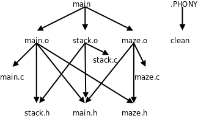

# 1. 基本规则

除了Hello World这种极简单的程序之外，一般的程序都是由多个源文件编译链接而成的，这些源文件的处理步骤通常用Makefile来管理。Makefile起什么作用呢？我们先看一个例子，这个例子由[例 12.3 "用深度优先搜索解迷宫问题"](../ch12/s03.md)改写而成：

```c
/* main.c */
#include <stdio.h>
#include "main.h"
#include "stack.h"
#include "maze.h"

struct point predecessor[MAX_ROW][MAX_COL] = {
	{{-1,-1}, {-1,-1}, {-1,-1}, {-1,-1}, {-1,-1}},
	{{-1,-1}, {-1,-1}, {-1,-1}, {-1,-1}, {-1,-1}},
	{{-1,-1}, {-1,-1}, {-1,-1}, {-1,-1}, {-1,-1}},
	{{-1,-1}, {-1,-1}, {-1,-1}, {-1,-1}, {-1,-1}},
	{{-1,-1}, {-1,-1}, {-1,-1}, {-1,-1}, {-1,-1}},
};

void visit(int row, int col, struct point pre)
{
	struct point visit_point = { row, col };
	maze[row][col] = 2;
	predecessor[row][col] = pre;
	push(visit_point);
}

int main(void)
{
	struct point p = { 0, 0 };

	maze[p.row][p.col] = 2;
	push(p);	
	
	while (!is_empty()) {
		p = pop();
		if (p.row == MAX_ROW - 1  /* goal */
		    && p.col == MAX_COL - 1)
			break;
		if (p.col+1 < MAX_COL     /* right */
		    && maze[p.row][p.col+1] == 0)
			visit(p.row, p.col+1, p);
		if (p.row+1 < MAX_ROW     /* down */
		    && maze[p.row+1][p.col] == 0)
			visit(p.row+1, p.col, p);
		if (p.col-1 >= 0          /* left */
		    && maze[p.row][p.col-1] == 0)
			visit(p.row, p.col-1, p);
		if (p.row-1 >= 0          /* up */
		    && maze[p.row-1][p.col] == 0)
			visit(p.row-1, p.col, p);
		print_maze();
	}
	if (p.row == MAX_ROW - 1 && p.col == MAX_COL - 1) {
		printf("(%d, %d)\n", p.row, p.col);
		while (predecessor[p.row][p.col].row != -1) {
			p = predecessor[p.row][p.col];
			printf("(%d, %d)\n", p.row, p.col);
		}
	} else
		printf("No path!\n");

	return 0;
}
```

我们把堆栈和迷宫的代码分别转移到模块`stack.c`和`maze.c`中，`main.c`包含它们提供的头文件`stack.h`和`maze.h`。

```c
/* main.h */
#ifndef MAIN_H
#define MAIN_H

typedef struct point { int row, col; } item_t;

#define MAX_ROW 5
#define MAX_COL 5

#endif
```

在`main.h`中定义了一个类型和两个常量，`main.c`、`stack.c`和`maze.c`都要用到这些定义，都要包含这个头文件。

```c
/* stack.c */
#include "stack.h"

static item_t stack[512];
static int top = 0;

void push(item_t p)
{
	stack[top++] = p;
}

item_t pop(void)
{
	return stack[--top];
}

int is_empty(void)
{
	return top == 0;
}
```

```c
/* stack.h */
#ifndef STACK_H
#define STACK_H

#include "main.h" /* provides definition for item_t */

extern void push(item_t);
extern item_t pop(void);
extern int is_empty(void);

#endif
```

[例 12.3 "用深度优先搜索解迷宫问题"](../ch12/s03.md)中的堆栈规定死了只能放`char`型数据，现在我们做进一步抽象，堆栈中放`item_t`类型的数据，`item_t`可以定义为任意类型，只要它能够通过函数的参数和返回值传递并且支持赋值操作就行。这也是一种避免硬编码的策略，`stack.c`中多次使用`item_t`类型，要改变它的定义只需改变`main.h`中的一行代码。

```c
/* maze.c */
#include <stdio.h>
#include "maze.h"

int maze[MAX_ROW][MAX_COL] = {
	0, 1, 0, 0, 0,
	0, 1, 0, 1, 0,
	0, 0, 0, 0, 0,
	0, 1, 1, 1, 0,
	0, 0, 0, 1, 0,
};

void print_maze(void)
{
	int i, j;
	for (i = 0; i < MAX_ROW; i++) {
		for (j = 0; j < MAX_COL; j++)
			printf("%d ", maze[i][j]);
		putchar('\n');
	}
	printf("*********\n");
}
```

```c
/* maze.h */
#ifndef MAZE_H
#define MAZE_H

#include "main.h" /* provides defintion for MAX_ROW and MAX_COL */

extern int maze[MAX_ROW][MAX_COL];
void print_maze(void);

#endif
```

`maze.c`中定义了一个`maze`数组和一个`print_maze`函数，需要在头文件`maze.h`中声明，以便提供给`main.c`使用，注意`print_maze`的声明可以不加`extern`，而`maze`的声明必须加`extern`。

这些源文件可以这样编译：

```bash
$ gcc main.c stack.c maze.c -o main
```

但这不是个好办法，如果编译之后又对`maze.c`做了修改，又要把所有源文件编译一遍，即使`main.c`、`stack.c`和那些头文件都没有修改也要跟着重新编译。一个大型的软件项目往往由上千个源文件组成，全部编译一遍需要几个小时，只改一个源文件就要求全部重新编译肯定是不合理的。

这样编译也许更好一些：

```bash
$ gcc -c main.c
$ gcc -c stack.c
$ gcc -c maze.c
$ gcc main.o stack.o maze.o -o main
```

如果编译之后又对`maze.c`做了修改，要重新编译只需要做两步：

```bash
$ gcc -c maze.c
$ gcc main.o stack.o maze.o -o main
```

这样又有一个问题，每次编译敲的命令都不一样，很容易出错，比如我修改了三个源文件，可能有一个忘了重新编译，结果编译完了修改没生效，运行时出了Bug还满世界找原因呢。更复杂的问题是，假如我改了`main.h`怎么办？所有包含`main.h`的源文件都需要重新编译，我得挨个找哪些源文件包含了`main.h`，有的还很不明显，例如`stack.c`包含了`stack.h`，而后者包含了`main.h`。可见手动处理这些问题非常容易出错，那有没有自动的解决办法呢？有，就是写一个`Makefile`文件和源代码放在同一个目录下：

```makefile
main: main.o stack.o maze.o
	gcc main.o stack.o maze.o -o main

main.o: main.c main.h stack.h maze.h
	gcc -c main.c

stack.o: stack.c stack.h main.h
	gcc -c stack.c

maze.o: maze.c maze.h main.h
	gcc -c maze.c
```

然后在这个目录下运行`make`编译：

```bash
$ make
gcc -c main.c
gcc -c stack.c
gcc -c maze.c
gcc main.o stack.o maze.o -o main
```

`make`命令会自动读取当前目录下的`Makefile`文件[^1]，完成相应的编译步骤。Makefile由一组规则（Rule）组成，每条规则的格式是：

```makefile
target ... : prerequisites ... 
	command1
	command2
	...
```

例如：

```makefile
main: main.o stack.o maze.o
	gcc main.o stack.o maze.o -o main
```

`main`是这条规则的目标（Target），`main.o`、`stack.o`和`maze.o`是这条规则的条件（Prerequisite）。目标和条件之间的关系是：*欲更新目标，必须首先更新它的所有条件；所有条件中只要有一个条件被更新了，目标也必须随之被更新*。所谓"更新"就是执行一遍规则中的命令列表，命令列表中的每条命令必须以一个Tab开头，注意不能是空格，Makefile的格式不像C语言的缩进那么随意，对于Makefile中的每个以Tab开头的命令，`make`会创建一个Shell进程去执行它。

对于上面这个例子，`make`执行如下步骤：

1. 尝试更新Makefile中第一条规则的目标`main`，第一条规则的目标称为缺省目标，只要缺省目标更新了就算完成任务了，其它工作都是为这个目的而做的。由于我们是第一次编译，`main`文件还没生成，显然需要更新，但规则说必须先更新了`main.o`、`stack.o`和`maze.o`这三个条件，然后才能更新`main`。

2. 所以`make`会进一步查找以这三个条件为目标的规则，这些目标文件也没有生成，也需要更新，所以执行相应的命令（`gcc -c main.c`、`gcc -c stack.c`和`gcc -c maze.c`）更新它们。

3. 最后执行`gcc main.o stack.o maze.o -o main`更新`main`。

如果没有做任何改动，再次运行`make`：

```bash
$ make
make: `main' is up to date.
```

`make`会提示缺省目标已经是最新的了，不需要执行任何命令更新它。再做个实验，如果修改了`maze.h`（比如加个无关痛痒的空格）再运行`make`：

```bash
$ make
gcc -c main.c
gcc -c maze.c
gcc main.o stack.o maze.o -o main
```

`make`会自动选择那些受影响的源文件重新编译，不受影响的源文件则不重新编译，这是怎么做到的呢？

1. `make`仍然尝试更新缺省目标，首先检查目标`main`是否需要更新，这就要检查三个条件`main.o`、`stack.o`和`maze.o`是否需要更新。

2. `make`会进一步查找以这三个条件为目标的规则，然后发现`main.o`和`maze.o`需要更新，因为它们都有一个条件是`maze.h`，而这个文件的修改时间比`main.o`和`maze.o`晚，所以执行相应的命令更新`main.o`和`maze.o`。

3. 既然`main`的三个条件中有两个被更新过了，那么`main`也需要更新，所以执行命令`gcc main.o stack.o maze.o -o main`更新`main`。

现在总结一下Makefile的规则，请读者结合上面的例子理解。如果一条规则的目标属于以下情况之一，就称为需要更新：

- 目标没有生成。
- 某个条件需要更新。
- 某个条件的修改时间比目标晚。

在一条规则被执行之前，规则的条件可能处于以下三种状态之一：

- 需要更新。能够找到以该条件为目标的规则，并且该规则中目标需要更新。
- 不需要更新。能够找到以该条件为目标的规则，但是该规则中目标不需要更新；或者不能找到以该条件为目标的规则，并且该条件已经生成。
- 错误。不能找到以该条件为目标的规则，并且该条件没有生成。

执行一条规则A的步骤如下：

1. 检查它的每个条件P：
   - 如果P需要更新，就执行以P为目标的规则B。之后，无论是否生成文件P，都认为P已被更新。
   - 如果找不到规则B，并且文件P已存在，表示P不需要更新。
   - 如果找不到规则B，并且文件P不存在，则报错退出。

2. 在检查完规则A的所有条件后，检查它的目标T，如果属于以下情况之一，就执行它的命令列表：
   - 文件T不存在。
   - 文件T存在，但是某个条件的修改时间比它晚。
   - 某个条件P已被更新（并不一定生成文件P）。

通常Makefile都会有一个`clean`规则，用于清除编译过程中产生的二进制文件，保留源文件：

```makefile
clean:
	@echo "cleanning project"
	-rm main *.o
	@echo "clean completed"
```

把这条规则添加到我们的Makefile末尾，然后执行这条规则：

```bash
$ make clean 
cleanning project
rm main *.o
clean completed
```

如果在`make`的命令行中指定一个目标（例如`clean`），则更新这个目标，如果不指定目标则更新Makefile中第一条规则的目标（缺省目标）。

和前面介绍的规则不同，`clean`目标不依赖于任何条件，并且执行它的命令列表不会生成`clean`这个文件，刚才说过，只要执行了命令列表就算更新了目标，即使目标并没有生成也算。在这个例子还演示了命令前面加`@`和`-`字符的效果：如果`make`执行的命令前面加了`@`字符，则不显示命令本身而只显示它的结果；通常`make`执行的命令如果出错（该命令的退出状态非0）就立刻终止，不再执行后续命令，但如果命令前面加了`-`号，即使这条命令出错，`make`也会继续执行后续命令。通常`rm`命令和`mkdir`命令前面要加`-`号，因为`rm`要删除的文件可能不存在，`mkdir`要创建的目录可能已存在，这两个命令都有可能出错，但这种错误是应该忽略的。例如上面已经执行过一遍`make clean`，再执行一遍就没有文件可删了，这时`rm`会报错，但`make`忽略这一错误，继续执行后面的`echo`命令：

```bash
$ make clean 
cleanning project
rm main *.o
rm: cannot remove `main': No such file or directory
rm: cannot remove `*.o': No such file or directory
make: [clean] Error 1 (ignored)
clean completed
```

读者可以把命令前面的`@`和`-`去掉再试试，对比一下结果有何不同。这里还有一个问题，如果当前目录下存在一个文件叫`clean`会怎么样呢？

```bash
$ touch clean
$ make clean
make: `clean' is up to date.
```

如果存在`clean`这个文件，`clean`目标又不依赖于任何条件，`make`就认为它不需要更新了。而我们希望把`clean`当作一个特殊的名字使用，不管它存在不存在都要更新，可以添一条特殊规则，把`clean`声明为一个伪目标：

```makefile
.PHONY: clean
```

这条规则没有命令列表。类似`.PHONY`这种`make`内建的特殊目标还有很多，各有不同的用途，详见[Managing Projects with GNU make](bi01.html#bibli.make)。在C语言中要求变量和函数先声明后使用，而Makefile不太一样，这条规则写在`clean:`规则的后面也行，也能起到声明`clean`是伪目标的作用：

```makefile
clean:
	@echo "cleanning project"
	-rm main *.o
	@echo "clean completed"

.PHONY: clean
```

当然写在前面也行。`gcc`处理一个C程序分为预处理和编译两个阶段，类似地，`make`处理Makefile的过程也分为两个阶段：

1. 首先从前到后读取所有规则，建立起一个完整的依赖关系图，例如：



2. 然后从缺省目标或者命令行指定的目标开始，根据依赖关系图选择适当的规则执行，执行Makefile中的规则和执行C代码不一样，并不是从前到后按顺序执行，也不是所有规则都要执行一遍，例如`make`缺省目标时不会更新`clean`目标，因为从上图可以看出，它跟缺省目标没有任何依赖关系。

`clean`目标是一个约定俗成的名字，在所有软件项目的Makefile中都表示清除编译生成的文件，类似这样的约定俗成的目标名字有：

- `all`，执行主要的编译工作，通常用作缺省目标。
- `install`，执行编译后的安装工作，把可执行文件、配置文件、文档等分别拷到不同的安装目录。
- `clean`，删除编译生成的二进制文件。
- `distclean`，不仅删除编译生成的二进制文件，也删除其它生成的文件，例如配置文件和格式转换后的文档，执行`make distclean`之后应该清除所有这些文件，只留下源文件。

[^1]: 只要符合本章所描述的语法的文件我们都叫它Makefile，而它的文件名则不一定是`Makefile`。事实上，执行`make`命令时，是按照`GNUmakefile`、`makefile`、`Makefile`的顺序找到第一个存在的文件并执行它，不过还是建议使用`Makefile`做文件名。除了GNU `make`，有些UNIX系统的`make`命令不是GNU `make`，不会查找`GNUmakefile`这个文件名，如果你写的Makefile包含GNU `make`的特殊语法，可以起名为`GNUmakefile`，否则不建议用这个文件名。 