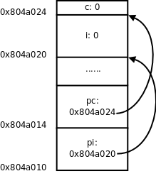

# 1. 指针的基本概念

在[第 12 章 栈与队列](../ch12/index.md)讲过，堆栈有栈顶指针，队列有头指针和尾指针，这些概念中的"指针"本质上是一个整数，是数组的索引，通过指针访问数组中的某个元素。在[图 20.3 "间接寻址"](../ch20/s04.md#link.indirect)我们又看到另外一种指针的概念，把一个变量所在的内存单元的地址保存在另外一个内存单元中，保存地址的这个内存单元称为指针，通过指针和间接寻址访问变量，这种指针在C语言中可以用一个指针类型的变量表示，例如某程序中定义了以下全局变量：

```c
int i;
int *pi = &i;
char c;
char *pc = &c;
```

这几个变量的内存布局如下图所示，在初学阶段经常要借助于这样的图来理解指针。



这里的`&`是取地址运算符（Address Operator），`&i`表示取变量`i`的地址，`int *pi = &i;`表示定义一个指向`int`型的指针变量`pi`，并用`i`的地址来初始化`pi`。我们讲过全局变量只能用常量表达式初始化，如果定义`int p = i;`就错了，因为`i`不是常量表达式，然而用`i`的地址来初始化一个指针却没有错，因为`i`的地址是在编译链接时能确定的，而不需要到运行时才知道，`&i`是常量表达式。后面两行代码定义了一个字符型变量`c`和一个指向`c`的字符型指针`pc`，注意`pi`和`pc`虽然是不同类型的指针变量，但它们的内存单元都占4个字节，因为要保存32位的虚拟地址，同理，在64位平台上指针变量都占8个字节。

我们知道，在同一个语句中定义多个数组，每一个都要有`[]`号：`int a[5], b[5];`。同样道理，在同一个语句中定义多个指针变量，每一个都要有`*`号，例如：

```c
int *p, *q;
```

如果写成`int* p, q;`就错了，这样是定义了一个整型指针`p`和一个整型变量`q`，定义数组的`[]`号写在变量后面，而定义指针的`*`号写在变量前面，更容易看错。定义指针的`*`号前后空格都可以省，写成`int*p,*q;`也算对，但`*`号通常和类型`int`之间留空格而和变量名写在一起，这样看`int *p, q;`就很明显是定义了一个指针和一个整型变量，就不容易看错了。

如果要让`pi`指向另一个整型变量`j`，可以重新对`pi`赋值：

```c
pi = &j;
```

如果要改变`pi`所指向的整型变量的值，比如把变量`j`的值增加10，可以写：

```c
*pi = *pi + 10;
```

这里的`*`号是指针间接寻址运算符（Indirection Operator），`*pi`表示取指针`pi`所指向的变量的值，也称为Dereference操作，指针有时称为变量的引用（Reference），所以根据指针找到变量称为Dereference。

`&`运算符的操作数必须是左值，因为只有左值才表示一个内存单元，才会有地址，运算结果是指针类型。`*`运算符的操作数必须是指针类型，运算结果可以做左值。所以，如果表达式`E`可以做左值，`*&E`和`E`等价，如果表达式`E`是指针类型，`&*E`和`E`等价。

指针之间可以相互赋值，也可以用一个指针初始化另一个指针，例如：

```c
int *ptri = pi;
```

或者：

```c
int *ptri;
ptri = pi;
```

表示*`pi`指向哪就让`ptri`也指向哪*，本质上就是把变量`pi`所保存的地址值赋给变量`ptri`。

用一个指针给另一个指针赋值时要注意，两个指针必须是同一类型的。在我们的例子中，`pi`是`int *`型的，`pc`是`char *`型的，`pi = pc;`这样赋值就是错误的。但是可以先强制类型转换然后赋值：

```c
pi = (int *)pc;
```


现在`pi`指向的地址和`pc`一样，但是通过`*pc`只能访问到一个字节，而通过`*pi`可以访问到4个字节，后3个字节已经不属于变量`c`了，除非你很确定变量`c`的一个字节和后面3个字节组合而成的`int`值是有意义的，否则就不应该给`pi`这么赋值。因此使用指针要特别小心，很容易将指针指向错误的地址，访问这样的地址可能导致段错误，可能读到无意义的值，也可能意外改写了某些数据，使得程序在随后的运行中出错。有一种情况需要特别注意，定义一个指针类型的局部变量而没有初始化：

```c
int main(void)
{
    int *p;
    ...
    *p = 0;
    ...
}
```

我们知道，在堆栈上分配的变量初始值是不确定的，也就是说指针`p`所指向的内存地址是不确定的，后面用`*p`访问不确定的地址就会导致不确定的后果，如果导致段错误还比较容易改正，如果意外改写了数据而导致随后的运行中出错，就很难找到错误原因了。像这种指向不确定地址的指针称为"野指针"（Unbound Pointer），为避免出现野指针，在定义指针变量时就应该给它明确的初值，或者把它初始化为`NULL`：

```c
int main(void)
{
    int *p = NULL;
    ...
    *p = 0;
    ...
}
```

`NULL`在C标准库的头文件`stddef.h`中定义：

```c
#define NULL ((void *)0)
```

就是把地址0转换成指针类型，称为空指针，它的特殊之处在于，操作系统不会把任何数据保存在地址0及其附近，也不会把地址0~0xfff的页面映射到物理内存，所以任何对地址0的访问都会立刻导致段错误。`*p = 0;`会导致段错误，就像放在眼前的炸弹一样很容易找到，相比之下，野指针的错误就像埋下地雷一样，更难发现和排除，这次走过去没事，下次走过去就有事。

讲到这里就该讲一下`void *`类型了。在编程时经常需要一种通用指针，可以转换为任意其它类型的指针，任意其它类型的指针也可以转换为通用指针，最初C语言没有`void *`类型，就把`char *`当通用指针，需要转换时就用类型转换运算符`()`，ANSI在将C语言标准化时引入了`void *`类型，`void *`指针与其它类型的指针之间可以隐式转换，而不必用类型转换运算符。注意，只能定义`void *`指针，而不能定义`void`型的变量，因为`void *`指针和别的指针一样都占4个字节，而如果定义`void`型变量（也就是类型暂时不确定的变量），编译器不知道该分配几个字节给变量。同样道理，`void *`指针不能直接Dereference，而必须先转换成别的类型的指针再做Dereference。`void *`指针常用于函数接口，比如：

```c
void func(void *pv)
{
    /* *pv = 'A' is illegal */
    char *pchar = pv;
    *pchar = 'A';
}

int main(void)
{
    char c;
    func(&c);
    printf("%c\n", c);
    ...
}
```

下一章讲函数接口时再详细介绍`void *`指针的用处。 