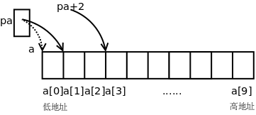

# 3. 指针与数组

先看个例子，有如下语句：

```c
int a[10];
int *pa = &a[0];
pa++;
```

首先指针`pa`指向`a[0]`的地址，注意后缀运算符的优先级高于单目运算符，所以是取`a[0]`的地址，而不是取`a`的地址。然后`pa++`让`pa`指向下一个元素（也就是`a[1]`），由于`pa`是`int *`指针，一个`int`型元素占4个字节，所以`pa++`使`pa`所指向的地址加4，注意不是加1。

下面画图理解。从前面的例子我们发现，地址的具体数值其实无关紧要，关键是要说明地址之间的关系（`a[1]`位于`a[0]`之后4个字节处）以及指针与变量之间的关系（指针保存的是变量的地址），现在我们换一种画法，省略地址的具体数值，用方框表示存储空间，用箭头表示指针和变量之间的关系。



既然指针可以用`++`运算符，当然也可以用`+`、`-`运算符，`pa+2`这个表达式也是有意义的，如上图所示，`pa`指向`a[1]`，那么`pa+2`指向a[3]。事实上，`E1[E2]`这种写法和`(*((E1)+(E2)))`是等价的，`*(pa+2)`也可以写成`pa[2]`，`pa`就像数组名一样，其实数组名也没有什么特殊的，`a[2]`之所以能取数组的第2个元素，是因为它等价于`*(a+2)`，在[第 1 节 "数组的基本概念"](../ch08/s01.md#array.intro)讲过数组名做右值时自动转换成指向首元素的指针，所以`a[2]`和`pa[2]`本质上是一样的，都是通过指针间接寻址访问元素。由于`(*((E1)+(E2)))`显然可以写成`(*((E2)+(E1)))`，所以`E1[E2]`也可以写成`E2[E1]`，这意味着`2[a]`、`2[pa]`这种写法也是对的，但一般不这么写。另外，由于`a`做右值使用时和`&a[0]`是一个意思，所以`int *pa = &a[0];`通常不这么写，而是写成更简洁的形式`int *pa = a;`。

在[第 1 节 "数组的基本概念"](../ch08/s01.md#array.intro)还讲过C语言允许数组下标是负数，现在你该明白为什么这样规定了。在上面的例子中，表达式`pa[-1]`是合法的，它和`a[0]`表示同一个元素。

现在猜一下，两个指针变量做比较运算（`>`、`>=`、`<`、`<=`、`==`、`!=`）表示什么意义？两个指针变量做减法运算又表示什么意义？

根据什么来猜？根据[第 3 节 "形参和实参"](../ch03/s03.md#func.paraarg)讲过的Rule of Least Surprise原则。你理解了指针和常数加减的概念，再根据以往使用比较运算的经验，就应该猜到`pa + 2 > pa`，`pa - 1 == a`，所以指针之间的比较运算比的是地址，C语言正是这样规定的，不过C语言的规定更为严谨，只有指向同一个数组中元素的指针之间相互比较才有意义，否则没有意义。那么两个指针相减表示什么？`pa - a`等于几？因为`pa - 1 == a`，所以`pa - a`显然应该等于1，指针相减表示两个指针之间相差的元素个数，同样只有指向同一个数组中元素的指针之间相减才有意义。两个指针相加表示什么？想不出来它能有什么意义，因此C语言也规定两个指针不能相加。假如C语言为指针相加也规定了一种意义，那就相当Surprise了，不符合一般的经验。无论是设计编程语言还是设计函数接口或人机界面都是这个道理，应该尽可能让用户根据以往的经验知识就能推断出该系统的基本用法。

在取数组元素时用数组名和用指针的语法一样，但如果把数组名做左值使用，和指针就有区别了。例如`pa++`是合法的，但`a++`就不合法，`pa = a + 1`是合法的，但`a = pa + 1`就不合法。数组名做右值时转换成指向首元素的指针，但做左值仍然表示整个数组的存储空间，而不是首元素的存储空间，数组名做左值还有一点特殊之处，不支持`++`、赋值这些运算符，但支持取地址运算符`&`，所以`&a`是合法的，我们将在[第 7 节 "指向数组的指针与多维数组"](./s07.md#pointer.array3)介绍这种语法。

在函数原型中，如果参数是数组，则等价于参数是指针的形式，例如：

```c
void func(int a[10])
{
    ...
}
```

等价于：

```c
void func(int *a)
{
    ...
}
```

第一种形式方括号中的数字可以不写，仍然是等价的：

```c
void func(int a[])
{
    ...
}
```

参数写成指针形式还是数组形式对编译器来说没区别，都表示这个参数是指针，之所以规定两种形式是为了给读代码的人提供有用的信息，如果这个参数指向一个元素，通常写成指针的形式，如果这个参数指向一串元素中的首元素，则经常写成数组的形式。 