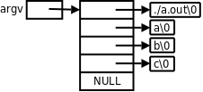

# 6. 指向指针的指针与指针数组

指针可以指向基本类型，也可以指向复合类型，因此也可以指向另外一个指针变量，称为指向指针的指针。

```c
int i;
int *pi = &i;
int **ppi = &pi;
```

这样定义之后，表达式`*ppi`取`pi`的值，表达式`**ppi`取`i`的值。请读者自己画图理解`i`、`pi`、`ppi`这三个变量之间的关系。

很自然地，也可以定义指向"指向指针的指针"的指针，但是很少用到：

```c
int ***p;
```

数组中的每个元素可以是基本类型，也可以复合类型，因此也可以是指针类型。例如定义一个数组`a`由10个元素组成，每个元素都是`int *`指针：

```c
int *a[10];
```

这称为指针数组。`int *a[10];`和`int **pa;`之间的关系类似于`int a[10];`和`int *pa;`之间的关系：`a`是由一种元素组成的数组，`pa`则是指向这种元素的指针。所以，如果`pa`指向`a`的首元素：

```c
int *a[10];
int **pa = &a[0];
```

则`pa[0]`和`a[0]`取的是同一个元素，唯一比原来复杂的地方在于这个元素是一个`int *`指针，而不是基本类型。

我们知道main函数的标准原型应该是`int main(int argc, char *argv[]);`。`argc`是命令行参数的个数。而`argv`是一个指向指针的指针，为什么不是指针数组呢？因为前面讲过，函数原型中的`[]`表示指针而不表示数组，等价于`char **argv`。那为什么要写成`char *argv[]`而不写成`char **argv`呢？这样写给读代码的人提供了有用信息，`argv`不是指向单个指针，而是指向一个指针数组的首元素。数组中每个元素都是`char *`指针，指向一个命令行参数字符串。

**例 23.2. 打印命令行参数**

```c
#include <stdio.h>

int main(int argc, char *argv[])
{
    int i;
    for(i = 0; i < argc; i++)
        printf("argv[%d]=%s\n", i, argv[i]);
    return 0;
}
```

编译执行：

```bash
$ gcc main.c
$ ./a.out a b c
argv[0]=./a.out
argv[1]=a
argv[2]=b
argv[3]=c
$ ln -s a.out printargv
$ ./printargv d e 
argv[0]=./printargv
argv[1]=d
argv[2]=e
```

注意程序名也算一个命令行参数，所以执行`./a.out a b c`这个命令时，`argc`是4，`argv`如下图所示：



由于`argv[4]`是`NULL`，我们也可以这样循环遍历`argv`：

```c
for(i=0; argv[i] != NULL; i++)
```

`NULL`标识着`argv`的结尾，这个循环碰到`NULL`就结束，因而不会访问越界，这种用法很形象地称为Sentinel，`NULL`就像一个哨兵守卫着数组的边界。

在这个例子中我们还看到，如果给程序建立符号链接，然后通过符号链接运行这个程序，就可以得到不同的`argv[0]`。通常，程序会根据不同的命令行参数做不同的事情，例如`ls -l`和`ls -R`打印不同的文件列表，而有些程序会根据不同的`argv[0]`做不同的事情，例如专门针对嵌入式系统的开源项目Busybox，将各种Linux命令裁剪后集于一身，编译成一个可执行文件`busybox`，安装时将`busybox`程序拷到嵌入式系统的`/bin`目录下，同时在`/bin`、`/sbin`、`/usr/bin`、`/usr/sbin`等目录下创建很多指向`/bin/busybox`的符号链接，命名为`cp`、`ls`、`mv`、`ifconfig`等等，不管执行哪个命令其实最终都是在执行`/bin/busybox`，它会根据`argv[0]`来区分不同的命令。

## 习题

1、想想以下定义中的`const`分别起什么作用？编写程序验证你的猜测。

```c
const char **p;
char *const *p;
char **const p;
``` 