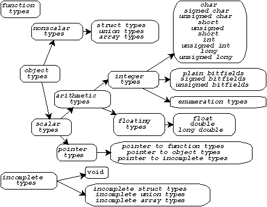
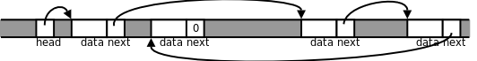

# 9. 不完全类型和复杂声明

在[第 1 节 "复合类型与结构体"](../ch07/s01.md#struct.intro)讲过算术类型、标量类型的概念，现在又学习了几种类型，我们完整地总结一下C语言的类型。下图出自[Standard C: A Reference](bi01.html#bibli.standardc)。



C语言的类型分为函数类型、对象类型和不完全类型三大类。对象类型又分为标量类型和非标量类型。指针类型属于标量类型，因此也可以做逻辑与、或、非运算的操作数和`if`、`for`、`while`的控制表达式，`NULL`指针表示假，非`NULL`指针表示真。不完全类型是暂时没有完全定义好的类型，编译器不知道这种类型该占几个字节的存储空间，例如：

```c
struct s;
union u;
char str[];
```

具有不完全类型的变量可以通过多次声明组合成一个完全类型，比如数组`str`声明两次：

```c
char str[];
char str[10];
```

当编译器碰到第一个声明时，认为`str`是一个不完全类型，碰到第二个声明时`str`就组合成完全类型了，如果编译器处理到程序文件的末尾仍然无法把`str`组合成一个完全类型，就会报错。读者可能会想，这个语法有什么用呢？为何不在第一次声明时就把`str`声明成完全类型？有些情况下这么做有一定的理由，比如第一个声明是写在头文件里的，第二个声明写在`.c`文件里，这样如果要改数组长度，只改`.c`文件就行了，头文件可以不用改。

不完全的结构体类型有重要作用：

```c
struct s {
    struct t *pt;
};

struct t {
    struct s *ps;
};
```

`struct s`和`struct t`各有一个指针成员指向另一种类型。编译器从前到后依次处理，当看到`struct s { struct t* pt; };`时，认为`struct t`是一个不完全类型，`pt`是一个指向不完全类型的指针，尽管如此，这个指针却是完全类型，因为不管什么指针都占4个字节存储空间，这一点很明确。然后编译器又看到`struct t { struct s *ps; };`，这时`struct t`有了完整的定义，就组合成一个完全类型了，`pt`的类型就组合成一个指向完全类型的指针。由于`struct s`在前面有完整的定义，所以`struct s *ps;`也定义了一个指向完全类型的指针。

这样的类型定义是错误的：

```c
struct s {
    struct t ot;
};

struct t {
    struct s os;
};
```

编译器看到`struct s { struct t ot; };`时，认为`struct t`是一个不完全类型，无法定义成员`ot`，因为不知道它该占几个字节。所以结构体中可以递归地定义指针成员，但不能递归地定义变量成员，你可以设想一下，假如允许递归地定义变量成员，`struct s`中有一个`struct t`，`struct t`中又有一个`struct s`，`struct s`又中有一个`struct t`，这就成了一个无穷递归的定义。

以上是两个结构体构成的递归定义，一个结构体也可以递归定义：

```c
struct s {
    char data[6];
    struct s* next;
};
```

当编译器处理到第一行`struct s {`时，认为`struct s`是一个不完全类型，当处理到第三行`struct s *next;`时，认为`next`是一个指向不完全类型的指针，当处理到第四行`};`时，`struct s`成了一个完全类型，`next`也成了一个指向完全类型的指针。类似这样的结构体是很多种数据结构的基本组成单元，如链表、二叉树等，我们将在后面详细介绍。下图示意了由几个`struct s`结构体组成的链表，这些结构体称为链表的节点（Node）。



`head`指针是链表的头指针，指向第一个节点，每个节点的`next`指针域指向下一个节点，最后一个节点的`next`指针域为`NULL`，在图中用0表示。

可以想像得到，如果把指针和数组、函数、结构体层层组合起来可以构成非常复杂的类型，下面看几个复杂的声明。

```c
typedef void (*sighandler_t)(int);
sighandler_t signal(int signum, sighandler_t handler);
```

这个声明来自`signal(2)`。`sighandler_t`是一个函数指针，它所指向的函数带一个参数，返回值为`void`，`signal`是一个函数，它带两个参数，一个`int`参数，一个`sighandler_t`参数，返回值也是`sighandler_t`参数。如果把这两行合成一行写，就是：

```c
void (*signal(int signum, void (*handler)(int)))(int);
```

在分析复杂声明时，要借助`typedef`把复杂声明分解成几种基本形式：

- `T *p;`，`p`是指向`T`类型的指针。
- `T a[];`，`a`是由`T`类型的元素组成的数组，但有一个例外，如果`a`是函数的形参，则相当于`T *a;`
- `T1 f(T2, T3...);`，`f`是一个函数，参数类型是`T2`、`T3`等等，返回值类型是`T1`。

我们分解一下这个复杂声明：

```c
int (*(*fp)(void *))[10];
```

1、`fp`和`*`号括在一起，说明`fp`是一个指针，指向`T1`类型：

```c
typedef int (*T1(void *))[10];
T1 *fp;
```

2、`T1`应该是一个函数类型，参数是`void *`，返回值是`T2`类型：

```c
typedef int (*T2)[10];
typedef T2 T1(void *);
T1 *fp;
```

3、`T2`和`*`号括在一起，应该也是个指针，指向`T3`类型：

```c
typedef int T3[10];
typedef T3 *T2;
typedef T2 T1(void *);
T1 *fp;
```

显然，`T3`是一个`int`数组，由10个元素组成。分解完毕。 