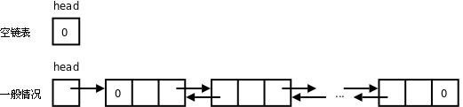
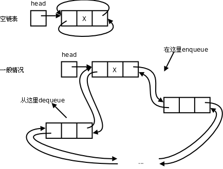

# 1. 链表

## 1.1. 单链表

[图 23.6 "链表"](../ch23/s09.md#链表)所示的链表即单链表（Single Linked List），本节我们学习如何创建和操作这种链表。每个链表有一个头指针，通过头指针可以找到第一个节点，每个节点都可以通过指针域找到它的后继，最后一个节点的指针域为`NULL`，表示没有后继。数组在内存中是连续存放的，而链表在内存中的布局是不规则的，我们知道访问某个数组元素`b[n]`时可以通过`基地址+n×每个元素的字节数`得到它地址，或者说数组支持随机访问，而链表是不支持随机访问的，只能通过前一个元素的指针域得知后一个元素的地址，因此只能从头指针开始顺序访问各节点。以下代码实现了单链表的基本操作。

### 例 26.1. 单链表

```c
/* linkedlist.h */
#ifndef LINKEDLIST_H
#define LINKEDLIST_H

typedef struct node *link;
struct node {
	unsigned char item;
	link next;
};

link make_node(unsigned char item);
void free_node(link p);
link search(unsigned char key);
void insert(link p);
void delete(link p);
void traverse(void (*visit)(link));
void destroy(void);
void push(link p);
link pop(void);

#endif
```

```c
/* linkedlist.c */
#include <stdlib.h>
#include "linkedlist.h"

static link head = NULL;

link make_node(unsigned char item)
{
	link p = malloc(sizeof *p);
	p->item = item;
	p->next = NULL;
	return p;
}

void free_node(link p)
{
	free(p);
}

link search(unsigned char key)
{
	link p;
	for (p = head; p; p = p->next)
		if (p->item == key)
			return p;
	return NULL;
}

void insert(link p)
{
	p->next = head;
	head = p;
}

void delete(link p)
{
	link pre;
	if (p == head) {
		head = p->next;
		return;
	}
	for (pre = head; pre; pre = pre->next)
		if (pre->next == p) {
			pre->next = p->next;
			return;
		}
}

void traverse(void (*visit)(link))
{
	link p;
	for (p = head; p; p = p->next)
		visit(p);
}

void destroy(void)
{
	link q, p = head;
	head = NULL;
	while (p) {
		q = p;
		p = p->next;
		free_node(q);
	}
}

void push(link p)
{
	insert(p);
}

link pop(void)
{
	if (head == NULL)
		return NULL;
	else {
		link p = head;
		head = head->next;
		return p;
	}
}
```

```c
/* main.c */
#include <stdio.h>
#include "linkedlist.h"

void print_item(link p)
{
	printf("%d\n", p->item); 
}

int main(void)
{
	link p = make_node(10);
	insert(p);
	p = make_node(5);
	insert(p);
	p = make_node(90);
	insert(p);
	p = search(5);
	delete(p);
	free_node(p);
	traverse(print_item);
	destroy();

	p = make_node(100);
	push(p);
	p = make_node(200);
	push(p);
	p = make_node(250);
	push(p);
	while (p = pop()) {
		print_item(p);
		free_node(p);
	}

	return 0;
}
```

在初始化时把头指针`head`初始化为`NULL`，表示空链表。然后`main`函数调用`make_node`创建几个节点，分别调用`insert`插入到链表中。

```c
void insert(link p)
{
	p->next = head;
	head = p;
}
```


正如上图所示，`insert`函数虽然简单，其中也隐含了一种特殊情况（Special Case）的处理，当`head`为`NULL`时，执行`insert`操作插入第一个节点之后，`head`指向第一个节点，而第一个节点的`next`指针域成为`NULL`，这很合理，因为它也是最后一个节点。所以空链表虽然是一种特殊情况，却不需要特殊的代码来处理，和一般情况用同样的代码处理即可，这样写出来的代码更简洁，但是在读代码时要想到可能存在的特殊情况。当然，`insert`函数传进来的参数`p`也可能有特殊情况，传进来的`p`可能是`NULL`，甚至是野指针，本章的函数代码都假定调用者的传进来的参数是合法的，不对参数做特别检查。事实上，对指针参数做检查是不现实的，如果传进来的是`NULL`还可以检查一下，如果传进来的是野指针，根本无法检查它指向的内存单元是不是合法的，C标准库的函数通常也不做这种检查，例如`strcpy(p, NULL)`就会引起段错误。

接下来`main`函数调用`search`在链表中查找某个节点，如果找到就返回指向该节点的指针，找不到就返回`NULL`。

```c
link search(unsigned char key)
{
	link p;
	for (p = head; p; p = p->next)
		if (p->item == key)
			return p;
	return NULL;
}
```

`search`函数其实也隐含了对于空链表这种特殊情况的处理，如果是空链表则循环体一次都不执行，直接返回`NULL`。

然后`main`函数调用`delete`从链表中摘除用`search`找到的节点，最后调用`free_node`释放它的存储空间。

```c
void delete(link p)
{
	link pre;
	if (p == head) {
		head = p->next;
		return;
	}
	for (pre = head; pre; pre = pre->next)
		if (pre->next == p) {
			pre->next = p->next;
			return;
		}
}
```


从上图可以看出，要摘除一个节点需要首先找到它的前趋然后才能做摘除操作，而在单链表中通过某个节点只能找到它的后继而不能找到它的前趋，所以删除操作要麻烦一些，需要从第一个节点开始依次查找要摘除的节点的前趋。`delete`操作也要处理一种特殊情况，如果要摘除的节点是链表的第一个节点，它是没有前趋的，这种情况要用特殊的代码处理，而不能和一般情况用同样的代码处理。这样很不爽，能不能把这种特殊情况转化为一般情况呢？可以把`delete`函数改成这样：

```c
void delete(link p)
{
	link *pnext;
	for (pnext = &head; *pnext; pnext = &(*pnext)->next)
		if (*pnext == p) {
			*pnext = p->next;
			return;
		}
}
```


定义一个指向指针的指针`pnext`，在`for`循环中`pnext`遍历的是指向链表中各节点的指针域，这样就把`head`指针和各节点的`next`指针统一起来了，可以在一个循环中处理。

然后`main`函数调用`traverse`函数遍历整个链表，调用`destroy`函数销毁整个链表。请读者自己阅读这两个函数的代码。

如果限定每次只在链表的头部插入和删除元素，就形成一个LIFO的访问序列，所以在链表头部插入和删除元素的操作实现了堆栈的`push`和`pop`操作，`main`函数的最后几步把链表当成堆栈来操作，从打印的结果可以看到出栈的顺序和入栈是相反的。想一想，用链表实现的堆栈和[第 2 节 "堆栈"](../ch12/s02.md#堆栈)中用数组实现的堆栈相比有什么优点和缺点？

### 习题

1. 修改`insert`函数实现插入排序的功能，链表中的数据按从小到大排列，每次插入数据都要在链表中找到合适的位置再插入。在[第 6 节 "折半查找"](../ch11/s06.md#折半查找)中我们看到，如果数组中的元素是有序排列的，可以用折半查找算法更快地找到某个元素，想一想如果链表中的节点是有序排列的，是否适用折半查找算法？为什么？

2. 基于单链表实现队列的`enqueue`和`dequeue`操作。在链表的末尾再维护一个指针`tail`，在`tail`处`enqueue`，在`head`处`dequeue`。想一想能不能反过来，在`head`处`enqueue`而在`tail`处`dequeue`？

3. 实现函数`void reverse(void);`将单链表反转。如下图所示。


## 1.2. 双向链表

链表的`delete`操作需要首先找到要摘除的节点的前趋，而在单链表中找某个节点的前趋需要从表头开始依次查找，对于n个节点的链表，删除操作的时间复杂度为O(n)。可以想像得到，如果每个节点再维护一个指向前趋的指针，删除操作就像插入操作一样容易了，时间复杂度为O(1)，这称为双向链表（Doubly Linked List）。要实现双向链表只需在上一节代码的基础上改动两个地方。

在`linkedlist.h`中修改链表节点的结构体定义：

```c
struct node {
	unsigned char item;
	link prev, next;
};
```

在`linkedlist.c`中修改`insert`和`delete`函数：

```c
void insert(link p)
{
	p->next = head;
	if (head)
		head->prev = p;
	head = p;
	p->prev = NULL;
}

void delete(link p)
{
	if (p->prev)
		p->prev->next = p->next;
	else
		head = p->next;
	if (p->next)
		p->next->prev = p->prev;
}
```



由于引入了`prev`指针，`insert`和`delete`函数中都有一些特殊情况需要用特殊的代码处理，不能和一般情况用同样的代码处理，这非常不爽，如果在表头和表尾各添加一个Sentinel节点（这两个节点只用于界定表头和表尾，不保存数据），就可以把这些特殊情况都转化为一般情况了。

### 例 26.2. 带Sentinel的双向链表

```c
/* doublylinkedlist.h */
#ifndef DOUBLYLINKEDLIST_H
#define DOUBLYLINKEDLIST_H

typedef struct node *link;
struct node {
	unsigned char item;
	link prev, next;
};

link make_node(unsigned char item);
void free_node(link p);
link search(unsigned char key);
void insert(link p);
void delete(link p);
void traverse(void (*visit)(link));
void destroy(void);
void enqueue(link p);
link dequeue(void);

#endif
```

```c
/* doublylinkedlist.c */
#include <stdlib.h>
#include "doublylinkedlist.h"

struct node tailsentinel;
struct node headsentinel = {0, NULL, &tailsentinel};
struct node tailsentinel = {0, &headsentinel, NULL};

static link head = &headsentinel;
static link tail = &tailsentinel;

link make_node(unsigned char item)
{
	link p = malloc(sizeof *p);
	p->item = item;
	p->prev = p->next = NULL;
	return p;
}

void free_node(link p)
{
	free(p);
}

link search(unsigned char key)
{
	link p;
	for (p = head->next; p != tail; p = p->next)
		if (p->item == key)
			return p;
	return NULL;
}

void insert(link p)
{
	p->next = head->next;
	head->next->prev = p;
	head->next = p;
	p->prev = head;
}

void delete(link p)
{
	p->prev->next = p->next;
	p->next->prev = p->prev;
}

void traverse(void (*visit)(link))
{
	link p;
	for (p = head->next; p != tail; p = p->next)
		visit(p);
}

void destroy(void)
{
	link q, p = head->next;
	head->next = tail;
	tail->prev = head;
	while (p != tail) {
		q = p;
		p = p->next;
		free_node(q);
	}
}

void enqueue(link p)
{
	insert(p);
}

link dequeue(void)
{
	if (tail->prev == head)
		return NULL;
	else {
		link p = tail->prev;
		delete(p);
		return p;
	}
}
```

```c
/* main.c */
#include <stdio.h>
#include "doublylinkedlist.h"

void print_item(link p)
{
	printf("%d\n", p->item); 
}

int main(void)
{
	link p = make_node(10);
	insert(p);
	p = make_node(5);
	insert(p);
	p = make_node(90);
	insert(p);
	p = search(5);
	delete(p);
	free_node(p);
	traverse(print_item);
	destroy();

	p = make_node(100);
	enqueue(p);
	p = make_node(200);
	enqueue(p);
	p = make_node(250);
	enqueue(p);
	while (p = dequeue()) {
		print_item(p);
		free_node(p);
	}

	return 0;
}
```


这个例子也实现了队列的`enqueue`和`dequeue`操作，现在每个节点有了`prev`指针，可以反过来在`head`处`enqueue`而在`tail`处`dequeue`了。

现在结合[第 5 节 "环形队列"](../ch12/s05.md#环形队列)想一想，其实用链表实现环形队列是最自然的，以前基于数组实现环形队列，我们还需要"假想"它是首尾相接的，而如果基于链表实现环形队列，我们本来就可以用指针串成首尾相接的。把上面的程序改成环形链表（Circular Linked List）也非常简单，只需要把`doublylinkedlist.c`中的

```c
struct node tailsentinel;
struct node headsentinel = {0, NULL, &tailsentinel};
struct node tailsentinel = {0, &headsentinel, NULL};

static link head = &headsentinel;
static link tail = &tailsentinel;
```

改成：

```c
struct node sentinel = {0, &sentinel, &sentinel};
static link head = &sentinel;
```

再把`doublylinkedlist.c`中所有的`tail`替换成`head`即可，相当于把`head`和`tail`合二为一了。



## 1.3. 静态链表

回想一下我们在[例 12.4 "用广度优先搜索解迷宫问题"](../ch12/s04.md#stackqueue.bfs)中使用的数据结构，我把图重新画在下面。


这是一个静态分配的数组，每个数组元素都有`row`、`col`和`predecessor`三个成员，`predecessor`成员保存一个数组下标，指向数组中的另一个元素，这其实也是链表的一种形式，称为静态链表，例如上图中的第6、4、2、1、0个元素串成一条链表。

## 1.4. 本节综合练习

1. Josephus是公元1世纪的著名历史学家，相传在一次战役中他和另外几个人被围困在山洞里，他们宁死不屈，决定站成一圈，每次数到三个人就杀一个，直到全部死光为止。Josephus和他的一个朋友不想死，于是串通好了站在适当的位置上，最后只剩下他们俩的时候这个游戏就停止了。如果一开始的人数为`N`，每次数到`M`个人就杀一个，那么要想不死应该站在什么位置呢？这个问题比较复杂，[具体数学]的1.3节研究了Josephus问题的解，有兴趣的读者可以参考。现在我们做个比较简单的练习，用链表模拟Josephus他们玩的这个游戏，`N`和`M`作为命令行参数传入，每个人的编号依次是1~N，打印每次被杀者的编号，打印最后一个幸存者的编号。

2. 在[第 2.11 节 "本节综合练习"](../ch25/s02.md#stdlib.ioproblem)的习题1中规定了一种日志文件的格式，每行是一条记录，由行号、日期、时间三个字段组成，由于记录是按时间先后顺序写入的，可以看作所有记录是按日期排序的，对于日期相同的记录再按时间排序。现在要求从这样的一个日志文件中读出所有记录组成一个链表，在链表中首先按时间排序，对于时间相同的记录再按日期排序，最后写回文件中。比如原文件的内容是：

```
1 2009-7-30 15:16:42
2 2009-7-30 15:16:43
3 2009-7-31 15:16:41
4 2009-7-31 15:16:42
5 2009-7-31 15:16:43
6 2009-7-31 15:16:44
```

重新排序输出的文件内容是：

```
1 2009-7-31 15:16:41
2 2009-7-30 15:16:42
3 2009-7-31 15:16:42
4 2009-7-30 15:16:43
5 2009-7-31 15:16:43
6 2009-7-31 15:16:44
```

---

[上一章](../ch25/index.md) | [目录](../index.md) | [下一节](./s02.md) 