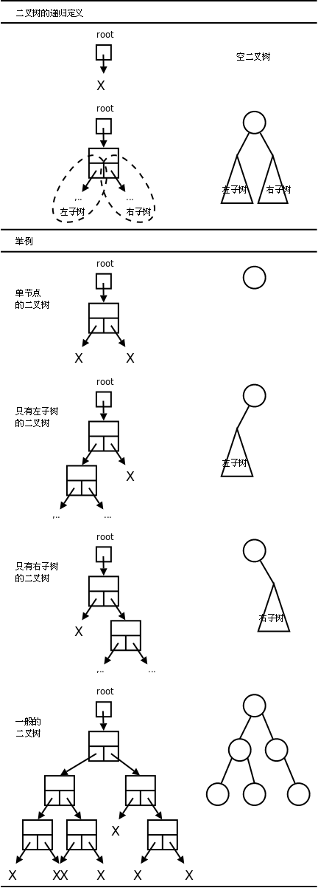
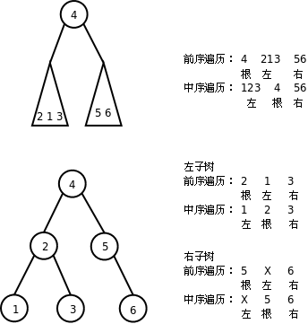

# 2. 二叉树

## 2.1. 二叉树的基本概念

链表的每个节点可以有一个后继，而二叉树（Binary Tree）的每个节点可以有两个后继。比如这样定义二叉树的节点：

```c
typedef struct node *link;
struct node {
	unsigned char item;
	link l, r;
};
```

这样的节点可以组织成下图所示的各种形态。



二叉树可以这样递归地定义：

1. 就像链表有头指针一样，每个二叉树都有一个根指针（上图中的`root`指针）指向它。根指针可以是`NULL`，表示空二叉树，或者
2. 根指针可以指向一个节点，这个节点除了有数据成员之外还有两个指针域，这两个指针域又分别是另外两个二叉树（左子树和右子树）的根指针。

上图举例示意了几种情况。

- 单节点的二叉树：左子树和右子树都是空二叉树。
- 只有左子树的二叉树：右子树是空二叉树。
- 只有右子树的二叉树：左子树是空二叉树。
- 一般的二叉树：左右子树都不为空。注意右侧由圈和线段组成的简化图示，以后我们都采用这种简化图示法，在圈中标上该节点数据成员的值。

链表的遍历方法是显而易见的：从前到后遍历即可。二叉树是一种树状结构，如何做到把所有节点都走一遍不重不漏呢？有以下几种方法：


前序（Pre-order Traversal）、中序（In-order Traversal）、后序遍历（Post-order Traversal）和深度优先搜索的顺序类似，层序遍历（Level-order Traversal）和广度优先搜索的顺序类似。

前序和中序遍历的结果合在一起可以唯一确定二叉树的形态，也就是说根据遍历结果可以构造出二叉树。过程如下图所示：



想一想，根据中序和后序遍历结果能否构造二叉树？根据前序和后序遍历结果能否构造二叉树？

### 例 26.3. 二叉树

```c
/* binarytree.h */
#ifndef BINARYTREE_H
#define BINARYTREE_H

typedef struct node *link;
struct node {
     unsigned char item;
     link l, r;
};

link init(unsigned char VLR[], unsigned char LVR[], int n);
void pre_order(link t, void (*visit)(link));
void in_order(link t, void (*visit)(link));
void post_order(link t, void (*visit)(link));
int count(link t);
int depth(link t);
void destroy(link t);

#endif
```

```c
/* binarytree.c */
#include <stdlib.h>
#include "binarytree.h"

static link make_node(unsigned char item)
{
	link p = malloc(sizeof *p);
	p->item = item;
	p->l = p->r = NULL;
	return p;
}

static void free_node(link p)
{
	free(p);
}

link init(unsigned char VLR[], unsigned char LVR[], int n)
{
	link t;
	int k;
	if (n <= 0)
		return NULL;
	for (k = 0; VLR[0] != LVR[k]; k++);
	t = make_node(VLR[0]);
	t->l = init(VLR+1, LVR, k);
	t->r = init(VLR+1+k, LVR+1+k, n-k-1);
	return t;
}

void pre_order(link t, void (*visit)(link))
{
	if (!t)
		return;
	visit(t);
	pre_order(t->l, visit);
	pre_order(t->r, visit);
}

void in_order(link t, void (*visit)(link))
{
	if (!t)
		return;
	in_order(t->l, visit);
	visit(t);
	in_order(t->r, visit);
}

void post_order(link t, void (*visit)(link))
{
	if (!t)
		return;
	post_order(t->l, visit);
	post_order(t->r, visit);
	visit(t);
}

int count(link t)
{
	if (!t)
		return 0;
	return 1 + count(t->l) + count(t->r);
}

int depth(link t)
{
	int dl, dr;
	if (!t)
		return 0;
	dl = depth(t->l);
	dr = depth(t->r);
	return 1 + (dl > dr ? dl : dr);
}

void destroy(link t)
{
	post_order(t, free_node);
}
```

```c
/* main.c */
#include <stdio.h>
#include "binarytree.h"

void print_item(link p)
{
	printf("%d", p->item);
}

int main()
{
	unsigned char pre_seq[] = { 4, 2, 1, 3, 6, 5, 7 };
	unsigned char in_seq[] = { 1, 2, 3, 4, 5, 6, 7 };
	link root = init(pre_seq, in_seq, 7);
	pre_order(root, print_item);
	putchar('\n');
	in_order(root, print_item);
	putchar('\n');
	post_order(root, print_item);
	putchar('\n');
	printf("count=%d depth=%d\n", count(root), depth(root));
	destroy(root);
	return 0;
}
```

### 习题

1. 本节描述了二叉树的递归定义，想一想单链表的递归定义应该怎么表述？请仿照本节的例子用递归实现单链表的各种操作函数：

```c
link init(unsigned char elements[], int n);
void pre_order(link t, void (*visit)(link));
void post_order(link t, void (*visit)(link));
int count(link t);
void destroy(link t);
```

## 2.2. 排序二叉树

排序二叉树（BST，Binary Search Tree）具有这样的性质：对于二叉树中的任意节点，如果它有左子树或右子树，则该节点的数据成员大于左子树所有节点的数据成员，且小于右子树所有节点的数据成员。排序二叉树的中序遍历结果是从小到大排列的，其实上一节的[图 26.10 "二叉树的遍历"](#二叉树的遍历)就是排序二叉树。

### 例 26.4. 排序二叉树

```c
/* bst.h */
#ifndef BST_H
#define BST_H

typedef struct node *link;
struct node {
     unsigned char item;
     link l, r;
};

link search(link t, unsigned char key);
link insert(link t, unsigned char key);
link delete(link t, unsigned char key);
void print_tree(link t);

#endif
```

```c
/* bst.c */
#include <stdlib.h>
#include <stdio.h>
#include "bst.h"

static link make_node(unsigned char item)
{
	link p = malloc(sizeof *p);
	p->item = item;
	p->l = p->r = NULL;
	return p;
}

static void free_node(link p)
{
	free(p);
}

link search(link t, unsigned char key)
{
	if (!t)
		return NULL;
	if (t->item > key)
		return search(t->l, key);
	if (t->item < key)
		return search(t->r, key);
	/* if (t->item == key) */
	return t;
}

link insert(link t, unsigned char key)
{
	if (!t)
		return make_node(key);
	if (t->item > key) /* insert to left subtree */
		t->l = insert(t->l, key);
	else /* if (t->item <= key), insert to right subtree */
		t->r = insert(t->r, key);
	return t;
}

link delete(link t, unsigned char key)
{
	link p;
	if (!t)
		return NULL;
	if (t->item > key) /* delete from left subtree */
		t->l = delete(t->l, key);
	else if (t->item < key) /* delete from right subtree */
		t->r = delete(t->r, key);
	else { /* if (t->item == key) */
		if (t->l == NULL && t->r == NULL) { /* if t is leaf node */
			free_node(t);
			t = NULL;
		} else if (t->l) { /* if t has left subtree */
			/* replace t with the rightmost node in left subtree */
			for (p = t->l; p->r; p = p->r);
			t->item = p->item;
			t->l = delete(t->l, t->item);
		} else { /* if t has right subtree */
			/* replace t with the leftmost node in right subtree */
			for (p = t->r; p->l; p = p->l);
			t->item = p->item;
			t->r = delete(t->r, t->item);
		}
	}
	return t;
}

void print_tree(link t)
{
	if (!t)
		return;
	printf("(");
	printf("%d", t->item);
	if (t->l) {
		printf(" ");
		print_tree(t->l);
	}
	if (t->r) {
		printf(" ");
		print_tree(t->r);
	}
	printf(")");
}
```

```c
/* main.c */
#include <stdio.h>
#include "bst.h"

int main()
{
	link root = NULL;
	root = insert(root, 4);
	root = insert(root, 2);
	root = insert(root, 6);
	root = insert(root, 1);
	root = insert(root, 3);
	root = insert(root, 5);
	root = insert(root, 7);
	print_tree(root);
	putchar('\n');
	root = delete(root, 4);
	print_tree(root);
	putchar('\n');
	return 0;
}
```

### 习题

1. 实现函数`void level_order(link t, void (*visit)(link));`对二叉树进行层序遍历。提示：使用队列。

2. 实现函数`void print_tree(link t);`以更直观的方式打印二叉树。例如：

```
   4
  / \
 2   6
/ \ / \
1 3 5 7
```

3. 实现函数`link balance(link t);`将排序二叉树转换为平衡二叉树。提示：先中序遍历得到有序数组，然后递归构造平衡二叉树。

---

[上一节](./s01.md) | [目录](../index.md) | [下一节](./s03.md) 