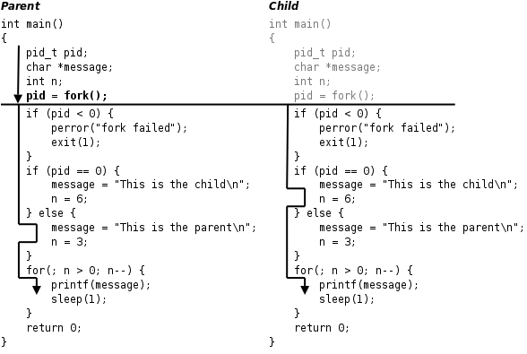
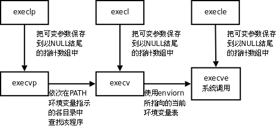

# 3. 进程控制

## 3.1. fork函数

```c
#include <sys/types.h>
#include <unistd.h>

pid_t fork(void);
```

`fork`调用失败则返回-1，调用成功的返回值见下面的解释。我们通过一个例子来理解`fork`是怎样创建新进程的。

```c
#include <sys/types.h>
#include <unistd.h>
#include <stdio.h>
#include <stdlib.h>

int main(void)
{
	pid_t pid;
	char *message;
	int n;
	pid = fork();
	if (pid < 0) {
		perror("fork failed");
		exit(1);
	}
	if (pid == 0) {
		message = "This is the child\n";
		n = 6;
	} else {
		message = "This is the parent\n";
		n = 3;
	}
	for(; n > 0; n--) {
		printf(message);
		sleep(1);
	}
	return 0;
}
```

执行结果为
```
$ ./a.out 
This is the child
This is the parent
This is the child
This is the parent
This is the child
This is the parent
This is the child
$ This is the child
This is the child
```

这个程序的运行过程如下图所示。



1. 父进程初始化。
2. 父进程调用`fork`，这是一个系统调用，因此进入内核。
3. 内核根据父进程复制出一个子进程，父进程和子进程的PCB信息相同，用户态代码和数据也相同。因此，*子进程现在的状态看起来和父进程一样，做完了初始化，刚调用了`fork`进入内核，还没有从内核返回*。
4. 现在有两个一模一样的进程看起来都调用了`fork`进入内核等待从内核返回（实际上`fork`只调用了一次），此外系统中还有很多别的进程也等待从内核返回。是父进程先返回还是子进程先返回，还是这两个进程都等待，先去调度执行别的进程，这都不一定，取决于内核的调度算法。
5. 如果某个时刻父进程被调度执行了，从内核返回后就从`fork`函数返回，保存在变量`pid`中的返回值是子进程的id，是一个大于0的整数，因此执下面的`else`分支，然后执行`for`循环，打印`"This is the parent\n"`三次之后终止。
6. 如果某个时刻子进程被调度执行了，从内核返回后就从`fork`函数返回，保存在变量`pid`中的返回值是0，因此执行下面的`if (pid == 0)`分支，然后执行`for`循环，打印`"This is the child\n"`六次之后终止。`fork`调用把父进程的数据复制一份给子进程，但此后二者互不影响，在这个例子中，`fork`调用之后父进程和子进程的变量`message`和`n`被赋予不同的值，互不影响。
7. 父进程每打印一条消息就睡眠1秒，这时内核调度别的进程执行，在1秒这么长的间隙里（对于计算机来说1秒很长了）子进程很有可能被调度到。同样地，子进程每打印一条消息就睡眠1秒，在这1秒期间父进程也很有可能被调度到。所以程序运行的结果基本上是父子进程交替打印，但这也不是一定的，取决于系统中其它进程的运行情况和内核的调度算法，如果系统中其它进程非常繁忙则有可能观察到不同的结果。另外，读者也可以把`sleep(1);`去掉看程序的运行结果如何。
8. 这个程序是在Shell下运行的，因此Shell进程是父进程的父进程。父进程运行时Shell进程处于等待状态（[第 3.3 节 "wait和waitpid函数"](#33-wait和waitpid函数)会讲到这种等待是怎么实现的），当父进程终止时Shell进程认为命令执行结束了，于是打印Shell提示符，而事实上子进程这时还没结束，所以子进程的消息打印到了Shell提示符后面。最后光标停在`This is the child`的下一行，这时用户仍然可以敲命令，即使命令不是紧跟在提示符后面，Shell也能正确读取。

`fork`函数的特点概括起来就是"调用一次，返回两次"，在父进程中调用一次，在父进程和子进程中各返回一次。从上图可以看出，一开始是一个控制流程，调用`fork`之后发生了分叉，变成两个控制流程，这也就是"fork"（分叉）这个名字的由来了。子进程中`fork`的返回值是0，而父进程中`fork`的返回值则是子进程的id（从根本上说`fork`是从内核返回的，内核自有办法让父进程和子进程返回不同的值），这样当`fork`函数返回后，程序员可以根据返回值的不同让父进程和子进程执行不同的代码。

`fork`的返回值这样规定是有道理的。`fork`在子进程中返回0，子进程仍可以调用`getpid`函数得到自己的进程id，也可以调用`getppid`函数得到父进程的id。在父进程中用`getpid`可以得到自己的进程id，然而要想得到子进程的id，只有将`fork`的返回值记录下来，别无它法。

`fork`的另一个特性是所有由父进程打开的描述符都被复制到子进程中。父、子进程中相同编号的文件描述符在内核中指向同一个`file`结构体，也就是说，`file`结构体的引用计数要增加。

用`gdb`调试多进程的程序会遇到困难，`gdb`只能跟踪一个进程（默认是跟踪父进程），而不能同时跟踪多个进程，但可以设置`gdb`在`fork`之后跟踪父进程还是子进程。以上面的程序为例：

```
$ gcc main.c -g
$ gdb a.out
GNU gdb 6.8-debian
Copyright (C) 2008 Free Software Foundation, Inc.
License GPLv3+: GNU GPL version 3 or later <http://gnu.org/licenses/gpl.html>
This is free software: you are free to change and redistribute it.
There is NO WARRANTY, to the extent permitted by law.  Type "show copying"
and "show warranty" for details.
This GDB was configured as "i486-linux-gnu"...
(gdb) l
2	#include <unistd.h>
3	#include <stdio.h>
4	#include <stdlib.h>
5	
6	int main(void)
7	{
8		pid_t pid;
9		char *message;
10		int n;
11		pid = fork();
(gdb) 
12		if(pid<0) {
13		perror("fork failed");
14		exit(1);
15	}
16		if(pid==0) {
17		message = "This is the child\n";
18		n = 6;
19	} else {
20		message = "This is the parent\n";
21		n = 3;
(gdb) b 17
Breakpoint 1 at 0x8048481: file main.c, line 17.
(gdb) set follow-fork-mode child
(gdb) r
Starting program: /home/akaedu/a.out 
This is the parent
[Switching to process 30725]

Breakpoint 1, main () at main.c:17
17		message = "This is the child\n";
(gdb) This is the parent
This is the parent
```

`set follow-fork-mode child`命令设置`gdb`在`fork`之后跟踪子进程（`set follow-fork-mode parent`则是跟踪父进程），然后用`run`命令，看到的现象是父进程一直在运行，在`(gdb)`提示符下打印消息，而子进程被先前设的断点打断了。

## 3.2. exec函数

用`fork`创建子进程后执行的是和父进程相同的程序（但有可能执行不同的代码分支），子进程往往要调用一种`exec`函数以执行另一个程序。当进程调用一种`exec`函数时，该进程的用户空间代码和数据完全被新程序替换，从新程序的启动例程开始执行。调用`exec`并不创建新进程，所以调用`exec`前后该进程的id并未改变。

其实有六种以`exec`开头的函数，统称`exec`函数：

```c
#include <unistd.h>

int execl(const char *path, const char *arg, ...);
int execlp(const char *file, const char *arg, ...);
int execle(const char *path, const char *arg, ..., char *const envp[]);
int execv(const char *path, char *const argv[]);
int execvp(const char *file, char *const argv[]);
int execve(const char *path, char *const argv[], char *const envp[]);
```

这些函数如果调用成功则加载新的程序从启动代码开始执行，不再返回，如果调用出错则返回-1，所以`exec`函数只有出错的返回值而没有成功的返回值。

这些函数原型看起来很容易混，但只要掌握了规律就很好记。不带字母p（表示path）的`exec`函数第一个参数必须是程序的相对路径或绝对路径，例如`"/bin/ls"`或`"./a.out"`，而不能是`"ls"`或`"a.out"`。对于带字母p的函数：
- 如果参数中包含/，则将其视为路径名。
- 否则视为不带路径的程序名，在`PATH`环境变量的目录列表中搜索这个程序。

带有字母l（表示list）的`exec`函数要求将新程序的每个命令行参数都当作一个参数传给它，命令行参数的个数是可变的，因此函数原型中有`...`，`...`中的最后一个可变参数应该是`NULL`，起sentinel的作用。对于带有字母v（表示vector）的函数，则应该先构造一个指向各参数的指针数组，然后将该数组的首地址当作参数传给它，数组中的最后一个指针也应该是`NULL`，就像`main`函数的`argv`参数或者环境变量表一样。

对于以e（表示environment）结尾的`exec`函数，可以把一份新的环境变量表传给它，其他`exec`函数仍使用当前的环境变量表执行新程序。

`exec`调用举例如下：

```c
char *const ps_argv[] ={"ps", "-o", "pid,ppid,pgrp,session,tpgid,comm", NULL};
char *const ps_envp[] ={"PATH=/bin:/usr/bin", "TERM=console", NULL};
execl("/bin/ps", "ps", "-o", "pid,ppid,pgrp,session,tpgid,comm", NULL);
execv("/bin/ps", ps_argv);
execle("/bin/ps", "ps", "-o", "pid,ppid,pgrp,session,tpgid,comm", NULL, ps_envp);
execve("/bin/ps", ps_argv, ps_envp);
execlp("ps", "ps", "-o", "pid,ppid,pgrp,session,tpgid,comm", NULL);
execvp("ps", ps_argv);
```

事实上，只有`execve`是真正的系统调用，其它五个函数最终都调用`execve`，所以`execve`在man手册第2节，其它函数在man手册第3节。这些函数之间的关系如下图所示。



一个完整的例子：

```c
#include <unistd.h>
#include <stdlib.h>

int main(void)
{
	execlp("ps", "ps", "-o", "pid,ppid,pgrp,session,tpgid,comm", NULL);
	perror("exec ps");
	exit(1);
}
```

执行此程序则得到：

```
$ ./a.out 
  PID  PPID  PGRP  SESS TPGID COMMAND
 6614  6608  6614  6614  7199 bash
 7199  6614  7199  6614  7199 ps
```

由于`exec`函数只有错误返回值，只要返回了一定是出错了，所以不需要判断它的返回值，直接在后面调用`perror`即可。注意在调用`execlp`时传了两个`"ps"`参数，第一个`"ps"`是程序名，`execlp`函数要在`PATH`环境变量中找到这个程序并执行它，而第二个`"ps"`是第一个命令行参数，`execlp`函数并不关心它的值，只是简单地把它传给`ps`程序，`ps`程序可以通过`main`函数的`argv[0]`取到这个参数。

调用`exec`后，原来打开的文件描述符仍然是打开的。利用这一点可以实现I/O重定向。先看一个简单的例子，把标准输入转成大写然后打印到标准输出：

```c
/* upper.c */
#include <stdio.h>

int main(void)
{
	int ch;
	while((ch = getchar()) != EOF) {
		putchar(toupper(ch));
	}
	return 0;
}
```

运行结果如下：

```
$ ./upper
hello THERE
HELLO THERE
（按Ctrl-D表示EOF）
$
```

使用Shell重定向：

```
$ cat file.txt
this is the file, file.txt, it is all lower case.
$ ./upper < file.txt
THIS IS THE FILE, FILE.TXT, IT IS ALL LOWER CASE.
```

如果希望把待转换的文件名放在命令行参数中，而不是借助于输入重定向，我们可以利用`upper`程序的现有功能，再写一个包装程序`wrapper`。

```c
/* wrapper.c */
#include <unistd.h>
#include <stdlib.h>
#include <stdio.h>
#include <fcntl.h>

int main(int argc, char *argv[])
{
	int fd;
	if (argc != 2) {
		fputs("usage: wrapper file\n", stderr);
		exit(1);
	}
	fd = open(argv[1], O_RDONLY);
	if(fd<0) {
		perror("open");
		exit(1);
	}
	dup2(fd, STDIN_FILENO);
	close(fd);
	execl("./upper", "upper", NULL);
	perror("exec ./upper");
	exit(1);
}
```

`wrapper`程序将命令行参数当作文件名打开，将标准输入重定向到这个文件，然后调用`exec`执行`upper`程序，这时原来打开的文件描述符仍然是打开的，`upper`程序只负责从标准输入读入字符转成大写，并不关心标准输入对应的是文件还是终端。运行结果如下：

```
$ ./wrapper file.txt
THIS IS THE FILE, FILE.TXT, IT IS ALL LOWER CASE.
```

## 3.3. wait和waitpid函数

一个进程在终止时会关闭所有文件描述符，释放在用户空间分配的内存，但它的PCB还保留着，内核在其中保存了一些信息：如果是正常终止则保存着退出状态，如果是异常终止则保存着导致该进程终止的信号是哪个。这个进程的父进程可以调用`wait`或`waitpid`获取这些信息，然后彻底清除掉这个进程。我们知道一个进程的退出状态可以在Shell中用特殊变量`$?`查看，因为Shell是它的父进程，当它终止时Shell调用`wait`或`waitpid`得到它的退出状态同时彻底清除掉这个进程。

如果一个进程已经终止，但是它的父进程尚未调用`wait`或`waitpid`对它进行清理，这时的进程状态称为僵尸（Zombie）进程。任何进程在刚终止时都是僵尸进程，正常情况下，僵尸进程都立刻被父进程清理了，为了观察到僵尸进程，我们自己写一个不正常的程序，父进程`fork`出子进程，子进程终止，而父进程既不终止也不调用`wait`清理子进程：

```c
#include <unistd.h>
#include <stdlib.h>

int main(void)
{
	pid_t pid=fork();
	if(pid<0) {
		perror("fork");
		exit(1);
	}
	if(pid>0) { /* parent */
		while(1);
	}
	/* child */
	return 0;	  
}
```

在后台运行这个程序，然后用`ps`命令查看：

```
$ ./a.out &
[1] 6130
$ ps u
USER       PID %CPU %MEM    VSZ   RSS TTY      STAT START   TIME COMMAND
akaedu    6016  0.0  0.3   5724  3140 pts/0    Ss   08:41   0:00 bash
akaedu    6130 97.2  0.0   1536   284 pts/0    R    08:44  14:33 ./a.out
akaedu    6131  0.0  0.0      0     0 pts/0    Z    08:44   0:00 [a.out] <defunct>
akaedu    6163  0.0  0.0   2620  1000 pts/0    R+   08:59   0:00 ps u
```

在`./a.out`命令后面加个`&`表示后台运行，Shell不等待这个进程终止就立刻打印提示符并等待用户输命令。现在Shell是位于前台的，用户在终端的输入会被Shell读取，后台进程是读不到终端输入的。第二条命令`ps u`是在前台运行的，在此期间Shell进程和`./a.out`进程都在后台运行，等到`ps u`命令结束时Shell进程又重新回到前台。在[第 33 章 信号](../ch33/index.md)和[第 34 章 终端、作业控制与守护进程](../ch34/index.md)将会进一步解释前台（Foreground）和后台（Backgroud）的概念。

父进程的pid是6130，子进程是僵尸进程，pid是6131，`ps`命令显示僵尸进程的状态为`Z`，在命令行一栏还显示`<defunct>`。

如果一个父进程终止，而它的子进程还存在（这些子进程或者仍在运行，或者已经是僵尸进程了），则这些子进程的父进程改为`init`进程。`init`是系统中的一个特殊进程，通常程序文件是`/sbin/init`，进程id是1，在系统启动时负责启动各种系统服务，之后就负责清理子进程，只要有子进程终止，`init`就会调用`wait`函数清理它。

僵尸进程是不能用`kill`命令清除掉的，因为`kill`命令只是用来终止进程的，而僵尸进程已经终止了。思考一下，用什么办法可以清除掉僵尸进程？

`wait`和`waitpid`函数的原型是：

```c
#include <sys/types.h>
#include <sys/wait.h>

pid_t wait(int *status);
pid_t waitpid(pid_t pid, int *status, int options);
```

若调用成功则返回清理掉的子进程id，若调用出错则返回-1。父进程调用`wait`或`waitpid`时可能会：
- 阻塞（如果它的所有子进程都还在运行）。
- 带子进程的终止信息立即返回（如果一个子进程已终止，正等待父进程读取其终止信息）。
- 出错立即返回（如果它没有任何子进程）。

这两个函数的区别是：
- 如果父进程的所有子进程都还在运行，调用`wait`将使父进程阻塞，而调用`waitpid`时如果在`options`参数中指定`WNOHANG`可以使父进程不阻塞而立即返回0。
- `wait`等待第一个终止的子进程，而`waitpid`可以通过`pid`参数指定等待哪一个子进程。

可见，调用`wait`和`waitpid`不仅可以获得子进程的终止信息，还可以使父进程阻塞等待子进程终止，起到进程间同步的作用。如果参数`status`不是空指针，则子进程的终止信息通过这个参数传出，如果只是为了同步而不关心子进程的终止信息，可以将`status`参数指定为`NULL`。

```c
#include <sys/types.h>
#include <sys/wait.h>
#include <unistd.h>
#include <stdio.h>
#include <stdlib.h>

int main(void)
{
	pid_t pid;
	pid = fork();
	if (pid < 0) {
		perror("fork failed");
		exit(1);
	}
	if (pid == 0) {
		int i;
		for (i = 3; i > 0; i--) {
			printf("This is the child\n");
			sleep(1);
		}
		exit(3);
	} else {
		int stat_val;
		waitpid(pid, &stat_val, 0);
		if (WIFEXITED(stat_val))
			printf("Child exited with code %d\n", WEXITSTATUS(stat_val));
		else if (WIFSIGNALED(stat_val))
			printf("Child terminated abnormally, signal %d\n", WTERMSIG(stat_val));
	}
	return 0;
}
```

子进程的终止信息在一个`int`中包含了多个字段，用宏定义可以取出其中的每个字段：如果子进程是正常终止的，`WIFEXITED`取出的字段值非零，`WEXITSTATUS`取出的字段值就是子进程的退出状态；如果子进程是收到信号而异常终止的，`WIFSIGNALED`取出的字段值非零，`WTERMSIG`取出的字段值就是信号的编号。作为练习，请读者从头文件里查一下这些宏做了什么运算，是如何取出字段值的。

### 习题

1、请读者修改[例 30.6 "waitpid"](#process.waitpid)的代码和实验条件，使它产生"Child terminated abnormally"的输出。 