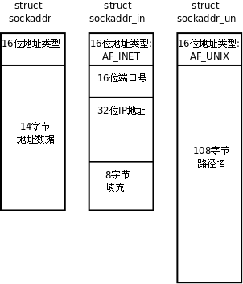

# 1. 预备知识

## 1.1. 网络字节序

我们已经知道，内存中的多字节数据相对于内存地址有大端和小端之分，磁盘文件中的多字节数据相对于文件中的偏移地址也有大端小端之分。网络数据流同样有大端小端之分，那么如何定义网络数据流的地址呢？发送主机通常将发送缓冲区中的数据按内存地址从低到高的顺序发出，接收主机把从网络上接到的字节依次保存在接收缓冲区中，也是按内存地址从低到高的顺序保存，因此，网络数据流的地址应这样规定：先发出的数据是低地址，后发出的数据是高地址。

TCP/IP协议规定，网络数据流应采用大端字节序，即低地址高字节。例如上一节的UDP段格式，地址0-1是16位的源端口号，如果这个端口号是1000（0x3e8），则地址0是0x03，地址1是0xe8，也就是先发0x03，再发0xe8，这16位在发送主机的缓冲区中也应该是低地址存0x03，高地址存0xe8。但是，如果发送主机是小端字节序的，这16位被解释成0xe803，而不是1000。因此，发送主机把1000填到发送缓冲区之前需要做字节序的转换。同样地，接收主机如果是小端字节序的，接到16位的源端口号也要做字节序的转换。如果主机是大端字节序的，发送和接收都不需要做转换。同理，32位的IP地址也要考虑网络字节序和主机字节序的问题。

为使网络程序具有可移植性，使同样的C代码在大端和小端计算机上编译后都能正常运行，可以调用以下库函数做网络字节序和主机字节序的转换。

```c
#include <arpa/inet.h>

uint32_t htonl(uint32_t hostlong);
uint16_t htons(uint16_t hostshort);
uint32_t ntohl(uint32_t netlong);
uint16_t ntohs(uint16_t netshort);
```

这些函数名很好记，h表示host，n表示network，l表示32位长整数，s表示16位短整数。例如htonl表示将32位的长整数从主机字节序转换为网络字节序，例如将IP地址转换后准备发送。如果主机是小端字节序，这些函数将参数做相应的大小端转换然后返回，如果主机是大端字节序，这些函数不做转换，将参数原封不动地返回。

## 1.2. socket地址的数据类型及相关函数

socket API是一层抽象的网络编程接口，适用于各种底层网络协议，如IPv4、IPv6，以及后面要讲的UNIX Domain Socket。然而，各种网络协议的地址格式并不相同，如下图所示：



IPv4和IPv6的地址格式定义在`netinet/in.h`中，IPv4地址用sockaddr_in结构体表示，包括16位端口号和32位IP地址，IPv6地址用sockaddr_in6结构体表示，包括16位端口号、128位IP地址和一些控制字段。UNIX Domain Socket的地址格式定义在`sys/un.h`中，用sockaddr_un结构体表示。各种socket地址结构体的开头都是相同的，前16位表示整个结构体的长度（并不是所有UNIX的实现都有长度字段，如Linux就没有），后16位表示地址类型。IPv4、IPv6和UNIX Domain Socket的地址类型分别定义为常数AF_INET、AF_INET6、AF_UNIX。这样，只要取得某种sockaddr结构体的首地址，不需要知道具体是哪种类型的sockaddr结构体，就可以根据地址类型字段确定结构体中的内容。因此，socket API可以接受各种类型的sockaddr结构体指针做参数，例如bind、accept、connect等函数，这些函数的参数应该设计成void *类型以便接受各种类型的指针，但是sock API的实现早于ANSI C标准化，那时还没有void *类型，因此这些函数的参数都用struct sockaddr *类型表示，在传递参数之前要强制类型转换一下，例如：

```c
struct sockaddr_in servaddr;
/* initialize servaddr */
bind(listen_fd, (struct sockaddr *)&servaddr, sizeof(servaddr));
```

本节只介绍基于IPv4的socket网络编程，sockaddr_in中的成员struct in_addr sin_addr表示32位的IP地址。但是我们通常用点分十进制的字符串表示IP地址，以下函数可以在字符串表示和in_addr表示之间转换。

字符串转in_addr的函数：

```c
#include <arpa/inet.h>

int inet_aton(const char *strptr, struct in_addr *addrptr);
in_addr_t inet_addr(const char *strptr);
int inet_pton(int family, const char *strptr, void *addrptr);
```

in_addr转字符串的函数：

```c
char *inet_ntoa(struct in_addr inaddr);
const char *inet_ntop(int family, const void *addrptr, char *strptr, size_t len);
```

其中inet_pton和inet_ntop不仅可以转换IPv4的in_addr，还可以转换IPv6的in6_addr，因此函数接口是void *addrptr。 