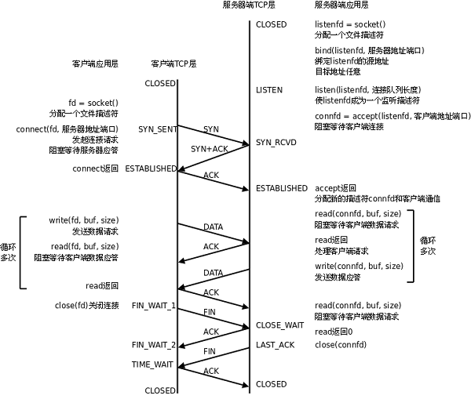

# 2. 基于TCP协议的网络程序

下图是基于TCP协议的客户端/服务器程序的一般流程：



服务器调用socket()、bind()、listen()完成初始化后，调用accept()阻塞等待，处于监听端口的状态，客户端调用socket()初始化后，调用connect()发出SYN段并阻塞等待服务器应答，服务器应答一个SYN-ACK段，客户端收到后从connect()返回，同时应答一个ACK段，服务器收到后从accept()返回。

数据传输的过程：

建立连接后，TCP协议提供全双工的通信服务，但是一般的客户端/服务器程序的流程是由客户端主动发起请求，服务器被动处理请求，一问一答的方式。因此，服务器从accept()返回后立刻调用read()，读socket就像读管道一样，如果没有数据到达就阻塞等待，这时客户端调用write()发送请求给服务器，服务器收到后从read()返回，对客户端的请求进行处理，在此期间客户端调用read()阻塞等待服务器的应答，服务器调用write()将处理结果发回给客户端，再次调用read()阻塞等待下一条请求，客户端收到后从read()返回，发送下一条请求，如此循环下去。

如果客户端没有更多的请求了，就调用close()关闭连接，就像写端关闭的管道一样，服务器的read()返回0，这样服务器就知道客户端关闭了连接，也调用close()关闭连接。注意，任何一方调用close()后，连接的两个传输方向都关闭，不能再发送数据了。如果一方调用shutdown()则连接处于半关闭状态，仍可接收对方发来的数据。

在学习socket API时要注意应用程序和TCP协议层是如何交互的：
* 应用程序调用某个socket函数时TCP协议层完成什么动作，比如调用connect()会发出SYN段
* 应用程序如何知道TCP协议层的状态变化，比如从某个阻塞的socket函数返回就表明TCP协议收到了某些段，再比如read()返回0就表明收到了FIN段

## 2.1. 最简单的TCP网络程序

下面通过最简单的客户端/服务器程序的实例来学习socket API。

server.c的作用是从客户端读字符，然后将每个字符转换为大写并回送给客户端。

```c
/* server.c */
#include <stdio.h>
#include <stdlib.h>
#include <string.h>
#include <unistd.h>
#include <sys/socket.h>
#include <netinet/in.h>

#define MAXLINE 80
#define SERV_PORT 8000

int main(void)
{
	struct sockaddr_in servaddr, cliaddr;
	socklen_t cliaddr_len;
	int listenfd, connfd;
	char buf[MAXLINE];
	char str[INET_ADDRSTRLEN];
	int i, n;

	listenfd = socket(AF_INET, SOCK_STREAM, 0);

	bzero(&servaddr, sizeof(servaddr));
	servaddr.sin_family = AF_INET;
	servaddr.sin_addr.s_addr = htonl(INADDR_ANY);
	servaddr.sin_port = htons(SERV_PORT);
    
	bind(listenfd, (struct sockaddr *)&servaddr, sizeof(servaddr));

	listen(listenfd, 20);

	printf("Accepting connections ...\n");
	while (1) {
		cliaddr_len = sizeof(cliaddr);
		connfd = accept(listenfd, 
				(struct sockaddr *)&cliaddr, &cliaddr_len);
	  
		n = read(connfd, buf, MAXLINE);
		printf("received from %s at PORT %d\n",
		       inet_ntop(AF_INET, &cliaddr.sin_addr, str, sizeof(str)),
		       ntohs(cliaddr.sin_port));
    
		for (i = 0; i < n; i++)
			buf[i] = toupper(buf[i]);
		write(connfd, buf, n);
		close(connfd);
	}
}
```

下面介绍程序中用到的socket API，这些函数都在`sys/socket.h`中。

```c
int socket(int family, int type, int protocol);
```

socket()打开一个网络通讯端口，如果成功的话，就像open()一样返回一个文件描述符，应用程序可以像读写文件一样用read/write在网络上收发数据，如果socket()调用出错则返回-1。对于IPv4，family参数指定为AF_INET。对于TCP协议，type参数指定为SOCK_STREAM，表示面向流的传输协议。如果是UDP协议，则type参数指定为SOCK_DGRAM，表示面向数据报的传输协议。protocol参数的介绍从略，指定为0即可。

```c
int bind(int sockfd, const struct sockaddr *myaddr, socklen_t addrlen);
```

服务器程序所监听的网络地址和端口号通常是固定不变的，客户端程序得知服务器程序的地址和端口号后就可以向服务器发起连接，因此服务器需要调用bind绑定一个固定的网络地址和端口号。bind()成功返回0，失败返回-1。

bind()的作用是将参数sockfd和myaddr绑定在一起，使sockfd这个用于网络通讯的文件描述符监听myaddr所描述的地址和端口号。前面讲过，struct sockaddr *是一个通用指针类型，myaddr参数实际上可以接受多种协议的sockaddr结构体，而它们的长度各不相同，所以需要第三个参数addrlen指定结构体的长度。我们的程序中对myaddr参数是这样初始化的：

```c
bzero(&servaddr, sizeof(servaddr));
servaddr.sin_family = AF_INET;
servaddr.sin_addr.s_addr = htonl(INADDR_ANY);
servaddr.sin_port = htons(SERV_PORT);
```

首先将整个结构体清零，然后设置地址类型为AF_INET，网络地址为INADDR_ANY，这个宏表示本地的任意IP地址，因为服务器可能有多个网卡，每个网卡也可能绑定多个IP地址，这样设置可以在所有的IP地址上监听，直到与某个客户端建立了连接时才确定下来到底用哪个IP地址，端口号为SERV_PORT，我们定义为8000。

```c
int listen(int sockfd, int backlog);
```

典型的服务器程序可以同时服务于多个客户端，当有客户端发起连接时，服务器调用的accept()返回并接受这个连接，如果有大量的客户端发起连接而服务器来不及处理，尚未accept的客户端就处于连接等待状态，listen()声明sockfd处于监听状态，并且最多允许有backlog个客户端处于连接待状态，如果接收到更多的连接请求就忽略。listen()成功返回0，失败返回-1。

```c
int accept(int sockfd, struct sockaddr *cliaddr, socklen_t *addrlen);
```

三方握手完成后，服务器调用accept()接受连接，如果服务器调用accept()时还没有客户端的连接请求，就阻塞等待直到有客户端连接上来。cliaddr是一个传出参数，accept()返回时传出客户端的地址和端口号。addrlen参数是一个传入传出参数（value-result argument），传入的是调用者提供的缓冲区cliaddr的长度以避免缓冲区溢出问题，传出的是客户端地址结构体的实际长度（有可能没有占满调用者提供的缓冲区）。如果给cliaddr参数传NULL，表示不关心客户端的地址。

我们的服务器程序结构是这样的：

```c
while (1) {
	cliaddr_len = sizeof(cliaddr);
	connfd = accept(listenfd, 
			(struct sockaddr *)&cliaddr, &cliaddr_len);
	n = read(connfd, buf, MAXLINE);
	...
	close(connfd);
}
```

整个是一个while死循环，每次循环处理一个客户端连接。由于cliaddr_len是传入传出参数，每次调用accept()之前应该重新赋初值。accept()的参数listenfd是先前的监听文件描述符，而accept()的返回值是另外一个文件描述符connfd，之后与客户端之间就通过这个connfd通讯，最后关闭connfd断开连接，而不关闭listenfd，再次回到循环开头listenfd仍然用作accept的参数。accept()成功返回一个文件描述符，出错返回-1。

client.c的作用是从命令行参数中获得一个字符串发给服务器，然后接收服务器返回的字符串并打印。

```c
/* client.c */
#include <stdio.h>
#include <stdlib.h>
#include <string.h>
#include <unistd.h>
#include <sys/socket.h>
#include <netinet/in.h>

#define MAXLINE 80
#define SERV_PORT 8000

int main(int argc, char *argv[])
{
	struct sockaddr_in servaddr;
	char buf[MAXLINE];
	int sockfd, n;
	char *str;
    
	if (argc != 2) {
		fputs("usage: ./client message\n", stderr);
		exit(1);
	}
	str = argv[1];
    
	sockfd = socket(AF_INET, SOCK_STREAM, 0);

	bzero(&servaddr, sizeof(servaddr));
	servaddr.sin_family = AF_INET;
	inet_pton(AF_INET, "127.0.0.1", &servaddr.sin_addr);
	servaddr.sin_port = htons(SERV_PORT);
    
	connect(sockfd, (struct sockaddr *)&servaddr, sizeof(servaddr));

	write(sockfd, str, strlen(str));

	n = read(sockfd, buf, MAXLINE);
	printf("Response from server:\n");
	write(STDOUT_FILENO, buf, n);

	close(sockfd);
	return 0;
}
```

由于客户端不需要固定的端口号，因此不必调用bind()，客户端的端口号由内核自动分配。注意，客户端不是不允许调用bind()，只是没有必要调用bind()固定一个端口号，服务器也不是必须调用bind()，但如果服务器不调用bind()，内核会自动给服务器分配监听端口，每次启动服务器时端口号都不一样，客户端要连接服务器就会遇到麻烦。

```c
int connect(int sockfd, const struct sockaddr *servaddr, socklen_t addrlen);
```

客户端需要调用connect()连接服务器，connect和bind的参数形式一致，区别在于bind的参数是自己的地址，而connect的参数是对方的地址。connect()成功返回0，出错返回-1。

先编译运行服务器: 
```bash
$ ./server
Accepting connections ...
```

然后在另一个终端里用netstat命令查看：
```bash
$ netstat -apn|grep 8000
tcp        0      0 0.0.0.0:8000            0.0.0.0:*               LISTEN     8148/server
```

可以看到server程序监听8000端口，IP地址还没确定下来。现在编译运行客户端：
```bash
$ ./client abcd
Response from server:
ABCD
```

回到server所在的终端，看看server的输出：
```bash
$ ./server
Accepting connections ...
received from 127.0.0.1 at PORT 59757
```

可见客户端的端口号是自动分配的。现在把客户端所连接的服务器IP改为其它主机的IP，试试两台主机的通讯。

再做一个小实验，在客户端的connect()代码之后插一个while(1);死循环，使客户端和服务器都处于连接中的状态，用netstat命令查看：
```bash
$ ./server &
[1] 8343
$ Accepting connections ...
./client abcd &
[2] 8344
$ netstat -apn|grep 8000
tcp        0      0 0.0.0.0:8000            0.0.0.0:*               LISTEN     8343/server         
tcp        0      0 127.0.0.1:44406         127.0.0.1:8000          ESTABLISHED8344/client         
tcp        0      0 127.0.0.1:8000          127.0.0.1:44406         ESTABLISHED8343/server
```

应用程序中的一个socket文件描述符对应一个socket pair，也就是源地址:源端口号和目的地址:目的端口号，也对应一个TCP连接。

| socket文件描述符 | 源地址:源端口号 | 目的地址:目的端口号 | 状态 |
|----------------|----------------|-------------------|------|
| server.c中的listenfd | 0.0.0.0:8000 | 0.0.0.0:* | LISTEN |
| server.c中的connfd | 127.0.0.1:8000 | 127.0.0.1:44406 | ESTABLISHED |
| client.c中的sockfd | 127.0.0.1:44406 | 127.0.0.1:8000 | ESTABLISHED | 

## 2.2. 错误处理与读写控制

上面的例子不仅功能简单，而且简单到几乎没有什么错误处理，我们知道，系统调用不能保证每次都成功，必须进行出错处理，这样一方面可以保证程序逻辑正常，另一方面可以迅速得到故障信息。

为使错误处理的代码不影响主程序的可读性，我们把与socket相关的一些系统函数加上错误处理代码包装成新的函数，做成一个模块wrap.c：

```c
#include <stdlib.h>
#include <errno.h>
#include <sys/socket.h>

void perr_exit(const char *s)
{
	perror(s);
	exit(1);
}

int Accept(int fd, struct sockaddr *sa, socklen_t *salenptr)
{
	int n;

again:
	if ( (n = accept(fd, sa, salenptr)) < 0) {
		if ((errno == ECONNABORTED) || (errno == EINTR))
			goto again;
		else
			perr_exit("accept error");
	}
	return n;
}

void Bind(int fd, const struct sockaddr *sa, socklen_t salen)
{
	if (bind(fd, sa, salen) < 0)
		perr_exit("bind error");
}

void Connect(int fd, const struct sockaddr *sa, socklen_t salen)
{
	if (connect(fd, sa, salen) < 0)
		perr_exit("connect error");
}

void Listen(int fd, int backlog)
{
	if (listen(fd, backlog) < 0)
		perr_exit("listen error");
}

int Socket(int family, int type, int protocol)
{
	int n;

	if ( (n = socket(family, type, protocol)) < 0)
		perr_exit("socket error");
	return n;
}

ssize_t Read(int fd, void *ptr, size_t nbytes)
{
	ssize_t n;

again:
	if ( (n = read(fd, ptr, nbytes)) == -1) {
		if (errno == EINTR)
			goto again;
		else
			return -1;
	}
	return n;
}

ssize_t Write(int fd, const void *ptr, size_t nbytes)
{
	ssize_t n;

again:
	if ( (n = write(fd, ptr, nbytes)) == -1) {
		if (errno == EINTR)
			goto again;
		else
			return -1;
	}
	return n;
}

void Close(int fd)
{
	if (close(fd) == -1)
		perr_exit("close error");
}
```

慢系统调用accept、read和write被信号中断时应该重试。connect虽然也会阻塞，但是被信号中断时不能立刻重试。对于accept，如果errno是ECONNABORTED，也应该重试。详细解释见参考资料。

TCP协议是面向流的，read和write调用的返回值往往小于参数指定的字节数。对于read调用，如果接收缓冲区中有20字节，请求读100个字节，就会返回20。对于write调用，如果请求写100个字节，而发送缓冲区中只有20个字节的空闲位置，那么write会阻塞，直到把100个字节全部交给发送缓冲区才返回，但如果socket文件描述符有O_NONBLOCK标志，则write不阻塞，直接返回20。为避免这些情况干扰主程序的逻辑，确保读写我们所请求的字节数，我们实现了两个包装函数readn和writen，也放在wrap.c中：

```c
ssize_t Readn(int fd, void *vptr, size_t n)
{
	size_t nleft;
	ssize_t nread;
	char *ptr;

	ptr = vptr;
	nleft = n;
	while (nleft > 0) {
		if ( (nread = read(fd, ptr, nleft)) < 0) {
			if (errno == EINTR)
				nread = 0;
			else
				return -1;
		} else if (nread == 0)
			break;

		nleft -= nread;
		ptr += nread;
	}
	return (n - nleft);
}

ssize_t Writen(int fd, const void *vptr, size_t n)
{
	size_t nleft;
	ssize_t nwritten;
	const char *ptr;

	ptr = vptr;
	nleft = n;
	while (nleft > 0) {
		if ( (nwritten = write(fd, ptr, nleft)) <= 0) {
			if (nwritten < 0 && errno == EINTR)
				nwritten = 0;
			else
				return -1;
		}

		nleft -= nwritten;
		ptr += nwritten;
	}
	return n;
}
```

这两个函数保证了读写n个字节才返回，除非遇到了EOF或错误。readn返回实际读到的字节数，如果返回值小于n则说明遇到了EOF。writen的返回值总是等于n，除非遇到了错误。

## 2.3. 把client改为交互式输入

上面的例子中，客户端一次性发送完所有数据就退出了，服务器也一次性接收完所有数据就退出了。现在我们把客户端改为交互式输入，服务器改为循环接收数据，直到客户端关闭连接。

```c
/* client.c */
#include <stdio.h>
#include <stdlib.h>
#include <string.h>
#include <unistd.h>
#include <sys/socket.h>
#include <netinet/in.h>

#define MAXLINE 80
#define SERV_PORT 8000

int main(void)
{
	struct sockaddr_in servaddr;
	char buf[MAXLINE];
	int sockfd, n;
	char *str;
    
	sockfd = socket(AF_INET, SOCK_STREAM, 0);

	bzero(&servaddr, sizeof(servaddr));
	servaddr.sin_family = AF_INET;
	inet_pton(AF_INET, "127.0.0.1", &servaddr.sin_addr);
	servaddr.sin_port = htons(SERV_PORT);
    
	connect(sockfd, (struct sockaddr *)&servaddr, sizeof(servaddr));

	while (fgets(buf, MAXLINE, stdin) != NULL) {
		write(sockfd, buf, strlen(buf));
		n = read(sockfd, buf, MAXLINE);
		if (n == 0)
			printf("the other side has been closed.\n");
		else
			write(STDOUT_FILENO, buf, n);
	}

	close(sockfd);
	return 0;
}
```

```c
/* server.c */
#include <stdio.h>
#include <stdlib.h>
#include <string.h>
#include <unistd.h>
#include <sys/socket.h>
#include <netinet/in.h>

#define MAXLINE 80
#define SERV_PORT 8000

int main(void)
{
	struct sockaddr_in servaddr, cliaddr;
	socklen_t cliaddr_len;
	int listenfd, connfd;
	char buf[MAXLINE];
	char str[INET_ADDRSTRLEN];
	int i, n;

	listenfd = socket(AF_INET, SOCK_STREAM, 0);

	bzero(&servaddr, sizeof(servaddr));
	servaddr.sin_family = AF_INET;
	servaddr.sin_addr.s_addr = htonl(INADDR_ANY);
	servaddr.sin_port = htons(SERV_PORT);
    
	bind(listenfd, (struct sockaddr *)&servaddr, sizeof(servaddr));

	listen(listenfd, 20);

	printf("Accepting connections ...\n");
	while (1) {
		cliaddr_len = sizeof(cliaddr);
		connfd = accept(listenfd, 
				(struct sockaddr *)&cliaddr, &cliaddr_len);
		printf("received from %s at PORT %d\n",
		       inet_ntop(AF_INET, &cliaddr.sin_addr, str, sizeof(str)),
		       ntohs(cliaddr.sin_port));
    
		while (1) {
			n = read(connfd, buf, MAXLINE);
			if (n == 0) {
				printf("the other side has been closed.\n");
				break;
			}
			for (i = 0; i < n; i++)
				buf[i] = toupper(buf[i]);
			write(connfd, buf, n);
		}
		close(connfd);
	}
}
```

## 2.4. 使用fork并发处理多个client的请求

上面的例子中，服务器一次只能处理一个客户端的请求，如果同时有多个客户端发起连接请求，服务器只能处理一个，其他客户端必须等待。现在我们把服务器改为并发处理多个客户端的请求，每accept一个客户端的连接请求就fork一个子进程来处理。

```c
/* server.c */
#include <stdio.h>
#include <stdlib.h>
#include <string.h>
#include <unistd.h>
#include <sys/socket.h>
#include <netinet/in.h>
#include <signal.h>

#define MAXLINE 80
#define SERV_PORT 8000

void do_sigchild(int num)
{
	while (waitpid(0, NULL, WNOHANG) > 0)
		;
}

int main(void)
{
	struct sockaddr_in servaddr, cliaddr;
	socklen_t cliaddr_len;
	int listenfd, connfd;
	char buf[MAXLINE];
	char str[INET_ADDRSTRLEN];
	int i, n;
	pid_t pid;

	struct sigaction newact;
	newact.sa_handler = do_sigchild;
	sigemptyset(&newact.sa_mask);
	newact.sa_flags = 0;
	sigaction(SIGCHLD, &newact, NULL);

	listenfd = socket(AF_INET, SOCK_STREAM, 0);

	bzero(&servaddr, sizeof(servaddr));
	servaddr.sin_family = AF_INET;
	servaddr.sin_addr.s_addr = htonl(INADDR_ANY);
	servaddr.sin_port = htons(SERV_PORT);
    
	bind(listenfd, (struct sockaddr *)&servaddr, sizeof(servaddr));

	listen(listenfd, 20);

	printf("Accepting connections ...\n");
	while (1) {
		cliaddr_len = sizeof(cliaddr);
		connfd = accept(listenfd, 
				(struct sockaddr *)&cliaddr, &cliaddr_len);
		pid = fork();
		if (pid < 0) {
			perr_exit("fork error");
		} else if (pid == 0) {
			close(listenfd);
			while (1) {
				n = read(connfd, buf, MAXLINE);
				if (n == 0) {
					printf("the other side has been closed.\n");
					break;
				}
				printf("received from %s at PORT %d\n",
				       inet_ntop(AF_INET, &cliaddr.sin_addr, str, sizeof(str)),
				       ntohs(cliaddr.sin_port));
				for (i = 0; i < n; i++)
					buf[i] = toupper(buf[i]);
				write(connfd, buf, n);
			}
			close(connfd);
			exit(0);
		} else {
			close(connfd);
		}
	}
}
```

## 2.5. setsockopt

在server的TCP连接没有完全断开之前不允许重新监听是不合理的。因为，TCP连接没有完全断开指的是connfd（127.0.0.1:8000）没有完全断开，而我们重新监听的是listenfd（0.0.0.0:8000），虽然是占用同一个端口，但IP地址不同，connfd对应的是与某个客户端通讯的一个具体的IP地址，而listenfd对应的是wildcard address。解决这个问题的方法是使用setsockopt()设置socket描述符的选项SO_REUSEADDR为1，表示允许创建端口号相同但IP地址不同的多个socket描述符。

在server代码的socket()和bind()调用之间插入如下代码：

```c
int opt = 1;
setsockopt(listenfd, SOL_SOCKET, SO_REUSEADDR, &opt, sizeof(opt));
```

## 2.6. 使用select

用fork()实现并发服务器，每个客户端连接都会创建一个子进程，当客户端很多时，会创建很多进程，进程切换的开销很大。使用select()可以解决这个问题，select()可以同时监听多个文件描述符，当某个文件描述符就绪（可读、可写或发生异常）时，select()返回就绪的文件描述符个数。

```c
/* server.c */
#include <stdio.h>
#include <stdlib.h>
#include <string.h>
#include <unistd.h>
#include <sys/socket.h>
#include <netinet/in.h>
#include <sys/select.h>

#define MAXLINE 80
#define SERV_PORT 8000

int main(void)
{
	int i, maxi, maxfd, listenfd, connfd, sockfd;
	int nready, client[FD_SETSIZE];
	ssize_t n;
	fd_set rset, allset;
	char buf[MAXLINE];
	char str[INET_ADDRSTRLEN];
	socklen_t cliaddr_len;
	struct sockaddr_in cliaddr, servaddr;

	listenfd = socket(AF_INET, SOCK_STREAM, 0);

	bzero(&servaddr, sizeof(servaddr));
	servaddr.sin_family = AF_INET;
	servaddr.sin_addr.s_addr = htonl(INADDR_ANY);
	servaddr.sin_port = htons(SERV_PORT);

	bind(listenfd, (struct sockaddr *)&servaddr, sizeof(servaddr));

	listen(listenfd, 20);

	maxfd = listenfd;
	maxi = -1;
	for (i = 0; i < FD_SETSIZE; i++)
		client[i] = -1;
	FD_ZERO(&allset);
	FD_SET(listenfd, &allset);

	for ( ; ; ) {
		rset = allset;
		nready = select(maxfd + 1, &rset, NULL, NULL, NULL);

		if (FD_ISSET(listenfd, &rset)) {
			cliaddr_len = sizeof(cliaddr);
			connfd = accept(listenfd, (struct sockaddr *)&cliaddr, &cliaddr_len);
			printf("received from %s at PORT %d\n",
			       inet_ntop(AF_INET, &cliaddr.sin_addr, str, sizeof(str)),
			       ntohs(cliaddr.sin_port));
			for (i = 0; i < FD_SETSIZE; i++)
				if (client[i] < 0) {
					client[i] = connfd;
					break;
				}
			if (i == FD_SETSIZE) {
				fputs("too many clients\n", stderr);
				exit(1);
			}

			FD_SET(connfd, &allset);
			if (connfd > maxfd)
				maxfd = connfd;
			if (i > maxi)
				maxi = i;
			if (--nready <= 0)
				continue;
		}

		for (i = 0; i <= maxi; i++) {
			if ( (sockfd = client[i]) < 0)
				continue;
			if (FD_ISSET(sockfd, &rset)) {
				if ( (n = read(sockfd, buf, MAXLINE)) == 0) {
					close(sockfd);
					FD_CLR(sockfd, &allset);
					client[i] = -1;
				} else {
					int j;
					for (j = 0; j < n; j++)
						buf[j] = toupper(buf[j]);
					write(sockfd, buf, n);
				}
				if (--nready <= 0)
					break;
			}
		}
	}
}
```

这个程序使用select()同时监听多个文件描述符，包括监听socket和与客户端通信的socket。当有新的客户端连接请求时，accept()返回新的socket描述符，将其加入监听集合。当有客户端数据到达时，read()返回，处理数据并回送给客户端。当客户端关闭连接时，read()返回0，关闭socket并清除监听集合。

使用select()的优点是：
1. 不需要为每个客户端创建一个进程，减少了进程切换的开销
2. 可以同时监听多个文件描述符，提高了并发处理能力
3. 可以设置超时时间，避免永久阻塞
4. 可以监听文件描述符的可读、可写和异常事件

缺点是：
1. 每次调用select()都需要在内核和用户空间之间复制文件描述符集合
2. 每次调用select()都需要遍历所有文件描述符，效率较低
3. 支持的文件描述符数量有限，默认是1024
4. 不能精确知道哪些文件描述符就绪，需要遍历所有文件描述符 