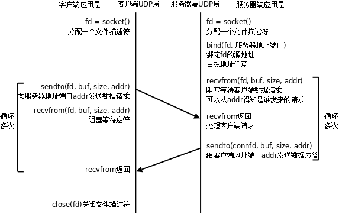

# 3. 基于UDP协议的网络程序

下图是典型的UDP客户端/服务器通讯过程：



以下是简单的UDP服务器和客户端程序。

```c
/* server.c */
#include <stdio.h>
#include <string.h>
#include <netinet/in.h>
#include "wrap.h"

#define MAXLINE 80
#define SERV_PORT 8000

int main(void)
{
	struct sockaddr_in servaddr, cliaddr;
	socklen_t cliaddr_len;
	int sockfd;
	char buf[MAXLINE];
	char str[INET_ADDRSTRLEN];
	int i, n;

	sockfd = Socket(AF_INET, SOCK_DGRAM, 0);

	bzero(&servaddr, sizeof(servaddr));
	servaddr.sin_family = AF_INET;
	servaddr.sin_addr.s_addr = htonl(INADDR_ANY);
	servaddr.sin_port = htons(SERV_PORT);
    
	Bind(sockfd, (struct sockaddr *)&servaddr, sizeof(servaddr));

	printf("Accepting connections ...\n");
	while (1) {
		cliaddr_len = sizeof(cliaddr);
		n = recvfrom(sockfd, buf, MAXLINE, 0, (struct sockaddr *)&cliaddr, &cliaddr_len);
		if (n == -1)
			perr_exit("recvfrom error");
		printf("received from %s at PORT %d\n",
		       inet_ntop(AF_INET, &cliaddr.sin_addr, str, sizeof(str)),
		       ntohs(cliaddr.sin_port));
    
		for (i = 0; i < n; i++)
			buf[i] = toupper(buf[i]);
		n = sendto(sockfd, buf, n, 0, (struct sockaddr *)&cliaddr, sizeof(cliaddr));
		if (n == -1)
			perr_exit("sendto error");
	}
}
```

```c
/* client.c */
#include <stdio.h>
#include <string.h>
#include <unistd.h>
#include <netinet/in.h>
#include "wrap.h"

#define MAXLINE 80
#define SERV_PORT 8000

int main(int argc, char *argv[])
{
	struct sockaddr_in servaddr;
	int sockfd, n;
	char buf[MAXLINE];
	char str[INET_ADDRSTRLEN];
	socklen_t servaddr_len;
    
	sockfd = Socket(AF_INET, SOCK_DGRAM, 0);

	bzero(&servaddr, sizeof(servaddr));
	servaddr.sin_family = AF_INET;
	inet_pton(AF_INET, "127.0.0.1", &servaddr.sin_addr);
	servaddr.sin_port = htons(SERV_PORT);
    
	while (fgets(buf, MAXLINE, stdin) != NULL) {
		n = sendto(sockfd, buf, strlen(buf), 0, (struct sockaddr *)&servaddr, sizeof(servaddr));
		if (n == -1)
			perr_exit("sendto error");

		n = recvfrom(sockfd, buf, MAXLINE, 0, NULL, 0);
		if (n == -1)
			perr_exit("recvfrom error");
	  
		Write(STDOUT_FILENO, buf, n);
	}

	Close(sockfd);
	return 0;
}
```

由于UDP不需要维护连接，程序逻辑简单了很多，但是UDP协议是不可靠的，实际上有很多保证通讯可靠性的机制需要在应用层实现。

编译运行server，在两个终端里各开一个client与server交互，看看server是否具有并发服务的能力。用Ctrl+C关闭server，然后再运行server，看此时client还能否和server联系上。和前面TCP程序的运行结果相比较，体会无连接的含义。 